# 🔐 Security Architecture

## Security Layers Overview

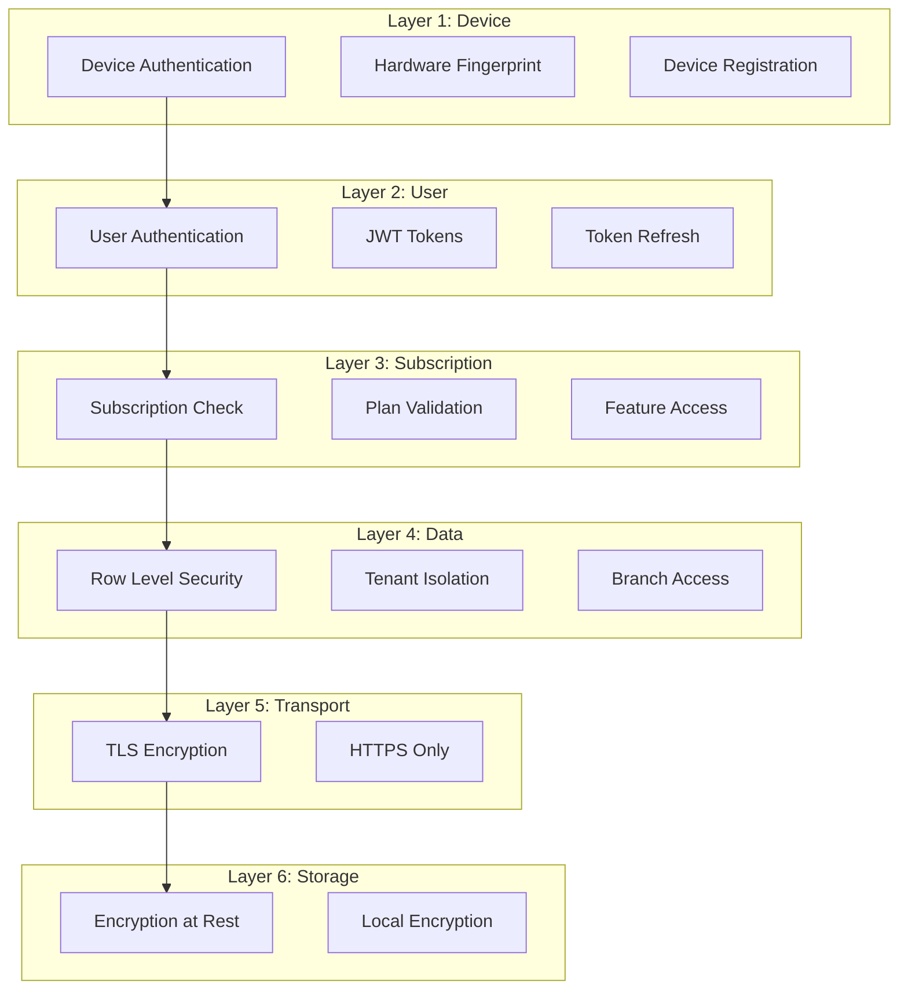
```mermaid
flowchart TB
    subgraph "Layer 1: Device"
        DEV[Device Authentication]
        FP[Hardware Fingerprint]
        REG[Device Registration]
    end

    subgraph "Layer 2: User"
        AUTH[User Authentication]
        JWT[JWT Tokens]
        REFRESH[Token Refresh]
    end

    subgraph "Layer 3: Subscription"
        SUB[Subscription Check]
        PLAN[Plan Validation]
        FEATURE[Feature Access]
    end

    subgraph "Layer 4: Data"
        RLS[Row Level Security]
        TENANT[Tenant Isolation]
        BRANCH[Branch Access]
    end

    subgraph "Layer 5: Transport"
        TLS[TLS Encryption]
        HTTPS[HTTPS Only]
    end

    subgraph "Layer 6: Storage"
        ENC[Encryption at Rest]
        LOCAL[Local Encryption]
    end

    DEV --> AUTH
    AUTH --> SUB
    SUB --> RLS
    RLS --> TLS
    TLS --> ENC
```

---

## Device Authentication

### Hardware Fingerprint Generation

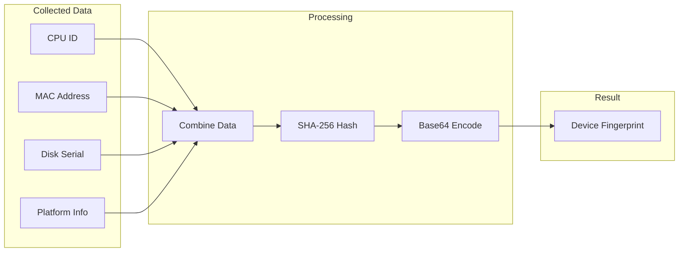
```mermaid
flowchart LR
    subgraph "Collected Data"
        CPU[CPU ID]
        MAC[MAC Address]
        DISK[Disk Serial]
        OS[Platform Info]
    end

    subgraph "Processing"
        COMBINE[Combine Data]
        HASH[SHA-256 Hash]
        ENCODE[Base64 Encode]
    end

    subgraph "Result"
        FP[Device Fingerprint]
    end

    CPU --> COMBINE
    MAC --> COMBINE
    DISK --> COMBINE
    OS --> COMBINE
    COMBINE --> HASH
    HASH --> ENCODE
    ENCODE --> FP
```

### Device Registration Flow

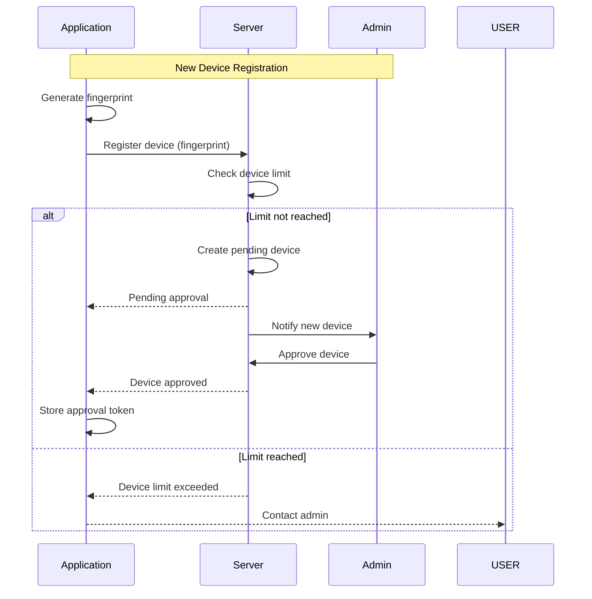
```mermaid
sequenceDiagram
    participant APP as Application
    participant SERVER as Server
    participant ADMIN as Admin

    Note over APP,ADMIN: New Device Registration

    APP->>APP: Generate fingerprint
    APP->>SERVER: Register device (fingerprint)
    SERVER->>SERVER: Check device limit

    alt Limit not reached
        SERVER->>SERVER: Create pending device
        SERVER-->>APP: Pending approval
        SERVER->>ADMIN: Notify new device

        ADMIN->>SERVER: Approve device
        SERVER-->>APP: Device approved
        APP->>APP: Store approval token
    else Limit reached
        SERVER-->>APP: Device limit exceeded
        APP-->>USER: Contact admin
    end
```

### Device Change Request

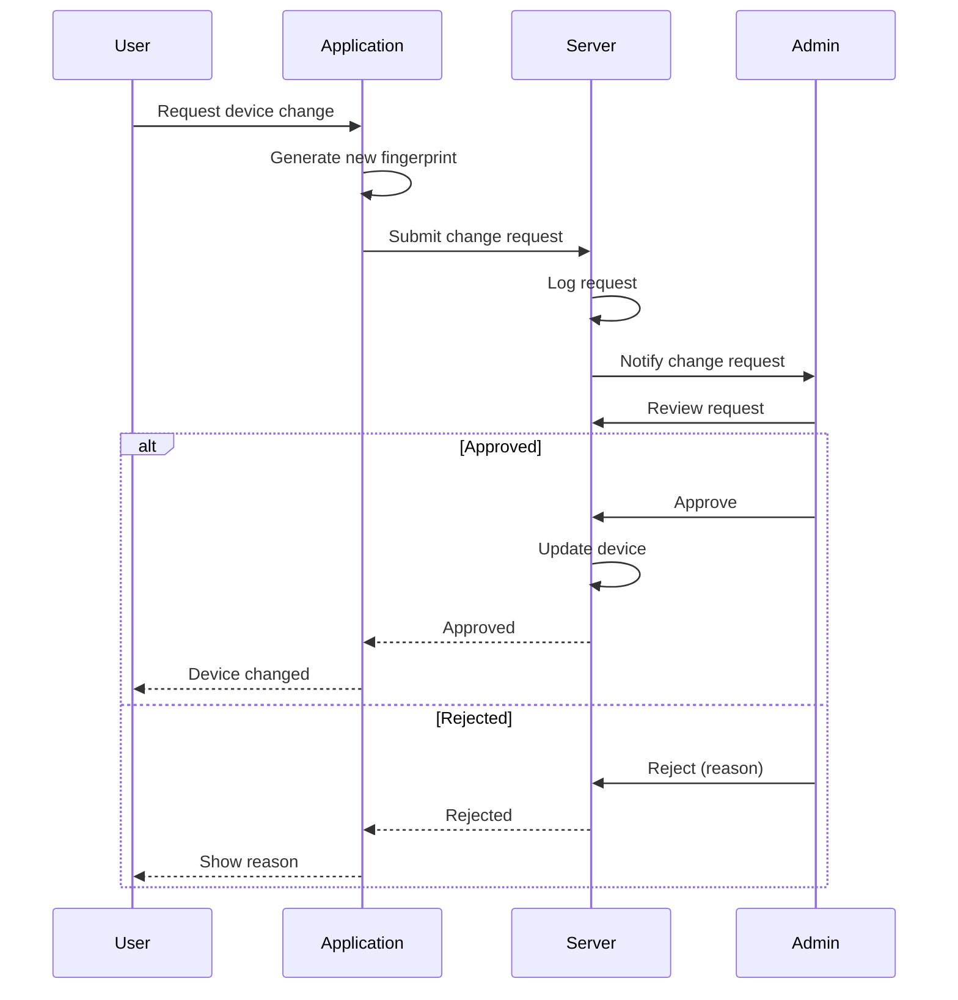
```mermaid
sequenceDiagram
    participant USER as User
    participant APP as Application
    participant SERVER as Server
    participant ADMIN as Admin

    USER->>APP: Request device change
    APP->>APP: Generate new fingerprint
    APP->>SERVER: Submit change request

    SERVER->>SERVER: Log request
    SERVER->>ADMIN: Notify change request

    ADMIN->>SERVER: Review request

    alt Approved
        ADMIN->>SERVER: Approve
        SERVER->>SERVER: Update device
        SERVER-->>APP: Approved
        APP-->>USER: Device changed
    else Rejected
        ADMIN->>SERVER: Reject (reason)
        SERVER-->>APP: Rejected
        APP-->>USER: Show reason
    end
```

---

## User Authentication

### Login Flow

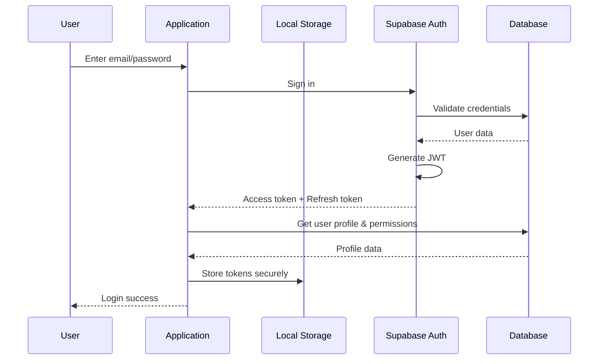
```mermaid
sequenceDiagram
    participant U as User
    participant APP as Application
    participant LOCAL as Local Storage
    participant AUTH as Supabase Auth
    participant DB as Database

    U->>APP: Enter email/password
    APP->>AUTH: Sign in
    AUTH->>DB: Validate credentials
    DB-->>AUTH: User data

    AUTH->>AUTH: Generate JWT
    AUTH-->>APP: Access token + Refresh token

    APP->>DB: Get user profile & permissions
    DB-->>APP: Profile data

    APP->>LOCAL: Store tokens securely
    APP-->>U: Login success
```

### JWT Token Structure

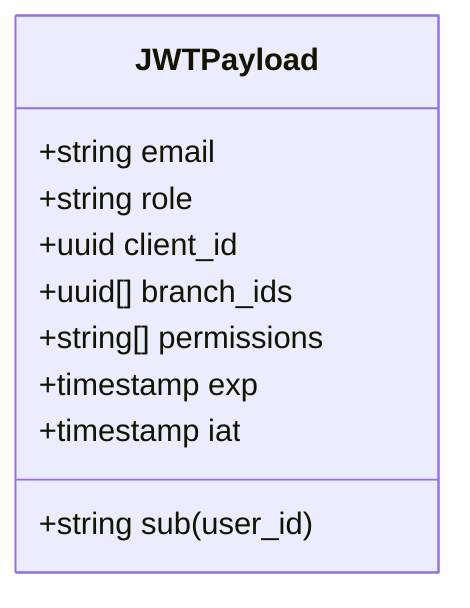
```mermaid
classDiagram
    class JWTPayload {
        +string sub (user_id)
        +string email
        +string role
        +uuid client_id
        +uuid[] branch_ids
        +string[] permissions
        +timestamp exp
        +timestamp iat
    }
```

### Token Refresh Flow

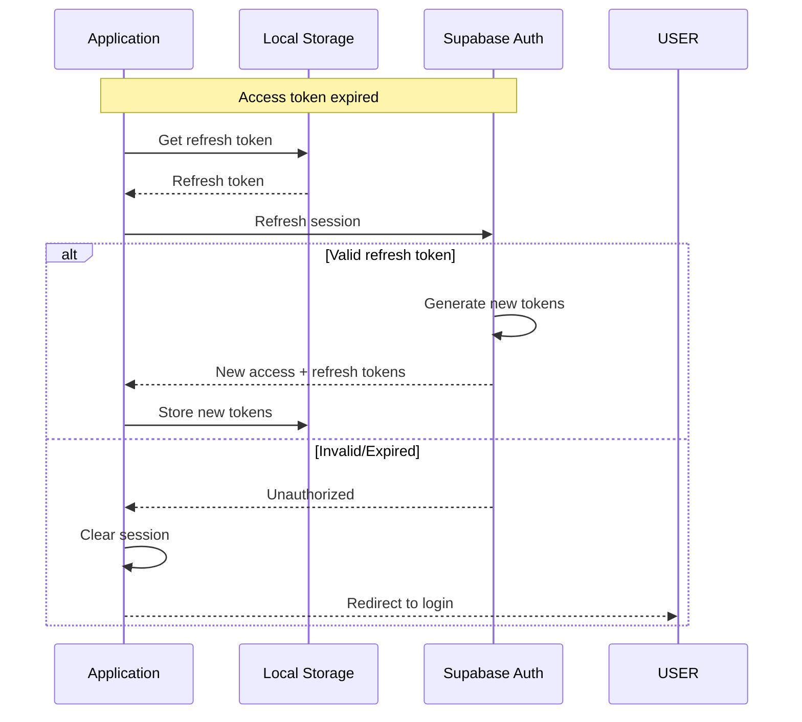
```mermaid
sequenceDiagram
    participant APP as Application
    participant LOCAL as Local Storage
    participant AUTH as Supabase Auth

    Note over APP,AUTH: Access token expired

    APP->>LOCAL: Get refresh token
    LOCAL-->>APP: Refresh token

    APP->>AUTH: Refresh session

    alt Valid refresh token
        AUTH->>AUTH: Generate new tokens
        AUTH-->>APP: New access + refresh tokens
        APP->>LOCAL: Store new tokens
    else Invalid/Expired
        AUTH-->>APP: Unauthorized
        APP->>APP: Clear session
        APP-->>USER: Redirect to login
    end
```

### PIN Code (Quick Login)

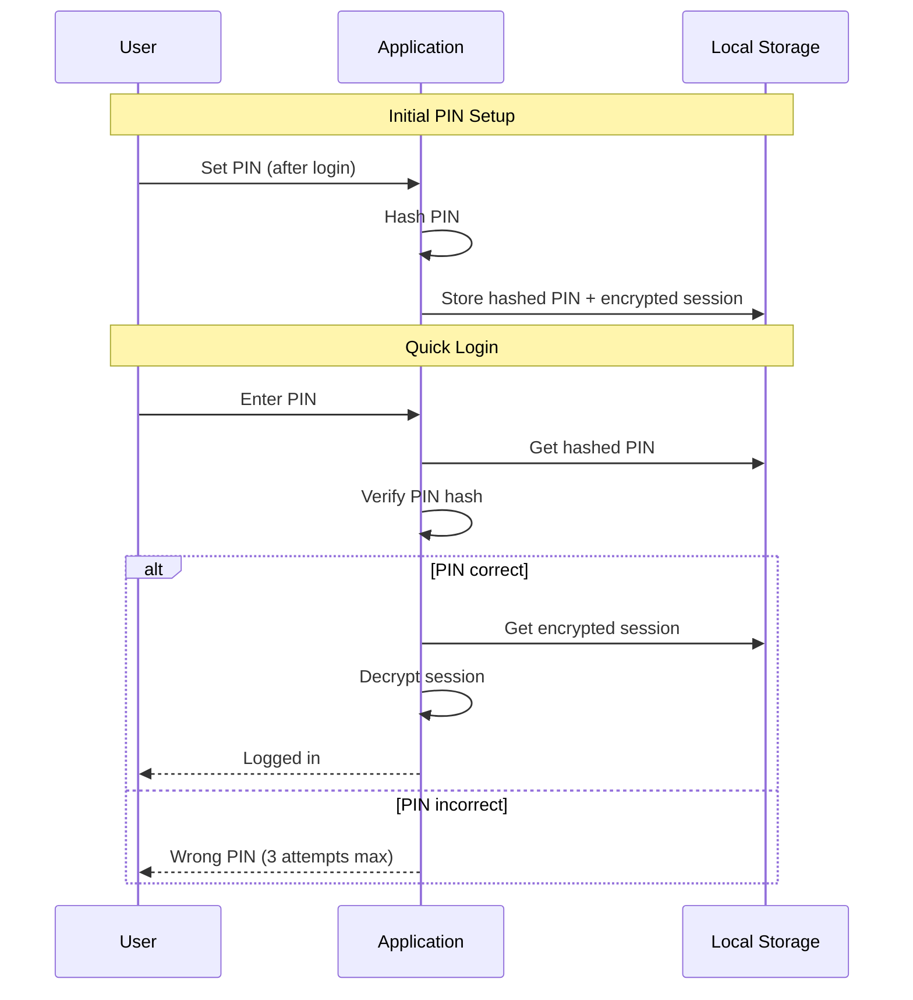
```mermaid
sequenceDiagram
    participant U as User
    participant APP as Application
    participant LOCAL as Local Storage

    Note over U,LOCAL: Initial PIN Setup
    U->>APP: Set PIN (after login)
    APP->>APP: Hash PIN
    APP->>LOCAL: Store hashed PIN + encrypted session

    Note over U,LOCAL: Quick Login
    U->>APP: Enter PIN
    APP->>LOCAL: Get hashed PIN
    APP->>APP: Verify PIN hash

    alt PIN correct
        APP->>LOCAL: Get encrypted session
        APP->>APP: Decrypt session
        APP-->>U: Logged in
    else PIN incorrect
        APP-->>U: Wrong PIN (3 attempts max)
    end
```

---

## Subscription Validation

### Subscription Check Flow

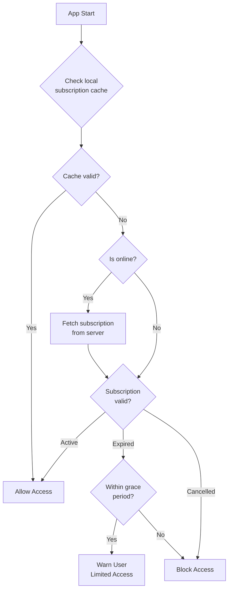
```mermaid
flowchart TD
    START[App Start]

    CHECK_LOCAL{Check local<br/>subscription cache}

    VALID_CACHE{Cache valid?}

    CHECK_ONLINE{Is online?}

    FETCH_SUB[Fetch subscription<br/>from server]

    VALIDATE{Subscription<br/>valid?}

    CHECK_GRACE{Within grace<br/>period?}

    ALLOW[Allow Access]
    BLOCK[Block Access]
    WARN[Warn User<br/>Limited Access]

    START --> CHECK_LOCAL
    CHECK_LOCAL --> VALID_CACHE

    VALID_CACHE -->|Yes| ALLOW
    VALID_CACHE -->|No| CHECK_ONLINE

    CHECK_ONLINE -->|Yes| FETCH_SUB
    CHECK_ONLINE -->|No| VALIDATE

    FETCH_SUB --> VALIDATE

    VALIDATE -->|Active| ALLOW
    VALIDATE -->|Expired| CHECK_GRACE
    VALIDATE -->|Cancelled| BLOCK

    CHECK_GRACE -->|Yes| WARN
    CHECK_GRACE -->|No| BLOCK
```

### Feature Access Control

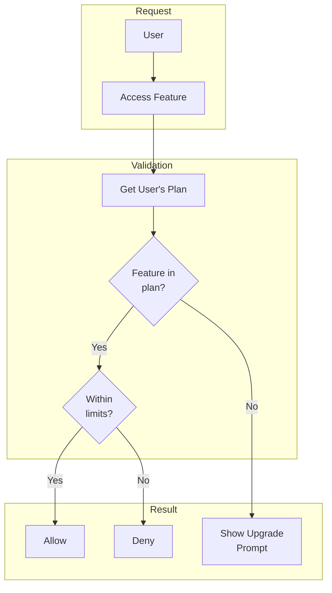
```mermaid
flowchart TD
    subgraph "Request"
        USER[User]
        ACTION[Access Feature]
    end

    subgraph "Validation"
        GET_PLAN[Get User's Plan]
        CHECK_FEATURE{Feature in<br/>plan?}
        CHECK_LIMIT{Within<br/>limits?}
    end

    subgraph "Result"
        ALLOW[Allow]
        DENY[Deny]
        UPGRADE[Show Upgrade<br/>Prompt]
    end

    USER --> ACTION
    ACTION --> GET_PLAN
    GET_PLAN --> CHECK_FEATURE

    CHECK_FEATURE -->|Yes| CHECK_LIMIT
    CHECK_FEATURE -->|No| UPGRADE

    CHECK_LIMIT -->|Yes| ALLOW
    CHECK_LIMIT -->|No| DENY
```

---

## Row Level Security (RLS)

### Multi-Tenant Isolation

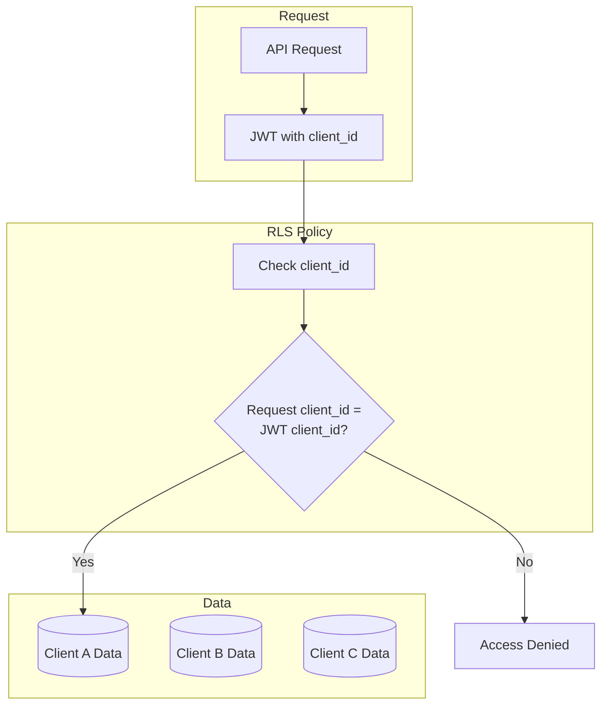
```mermaid
flowchart TD
    subgraph "Request"
        REQ[API Request]
        JWT[JWT with client_id]
    end

    subgraph "RLS Policy"
        POLICY[Check client_id]
        MATCH{Request client_id =<br/>JWT client_id?}
    end

    subgraph "Data"
        CLIENT_A[(Client A Data)]
        CLIENT_B[(Client B Data)]
        CLIENT_C[(Client C Data)]
    end

    REQ --> JWT
    JWT --> POLICY
    POLICY --> MATCH

    MATCH -->|Yes| CLIENT_A
    MATCH -->|No| DENIED[Access Denied]
```

### Branch Level Access

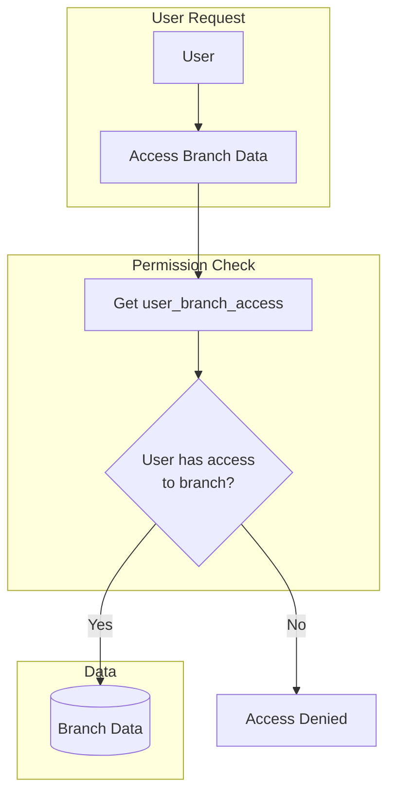
```mermaid
flowchart TD
    subgraph "User Request"
        USER[User]
        BRANCH_REQ[Access Branch Data]
    end

    subgraph "Permission Check"
        GET_ACCESS[Get user_branch_access]
        HAS_ACCESS{User has access<br/>to branch?}
    end

    subgraph "Data"
        BRANCH_DATA[(Branch Data)]
    end

    USER --> BRANCH_REQ
    BRANCH_REQ --> GET_ACCESS
    GET_ACCESS --> HAS_ACCESS

    HAS_ACCESS -->|Yes| BRANCH_DATA
    HAS_ACCESS -->|No| DENIED[Access Denied]
```

### RLS Policies Implementation

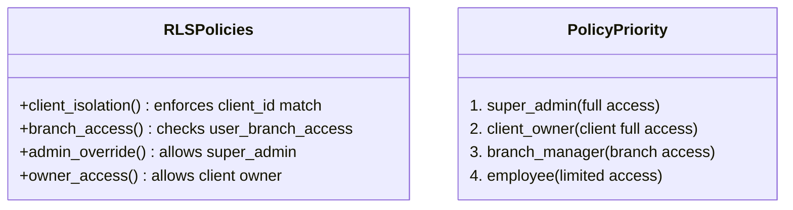
```mermaid
classDiagram
    class RLSPolicies {
        +client_isolation() enforces client_id match
        +branch_access() checks user_branch_access
        +admin_override() allows super_admin
        +owner_access() allows client owner
    }

    class PolicyPriority {
        1. super_admin (full access)
        2. client_owner (client full access)
        3. branch_manager (branch access)
        4. employee (limited access)
    }
```

---

## Data Encryption

### Encryption Layers

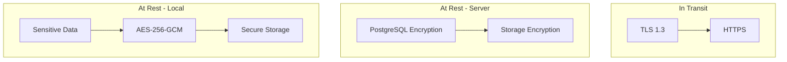
```mermaid
flowchart TB
    subgraph "In Transit"
        TLS[TLS 1.3]
        HTTPS[HTTPS]
    end

    subgraph "At Rest - Server"
        PG_ENC[PostgreSQL Encryption]
        STORAGE_ENC[Storage Encryption]
    end

    subgraph "At Rest - Local"
        SENSITIVE[Sensitive Data]
        AES[AES-256-GCM]
        SECURE_STORE[Secure Storage]
    end

    TLS --> HTTPS

    PG_ENC --> STORAGE_ENC

    SENSITIVE --> AES --> SECURE_STORE
```

### Local Encryption for Sensitive Data

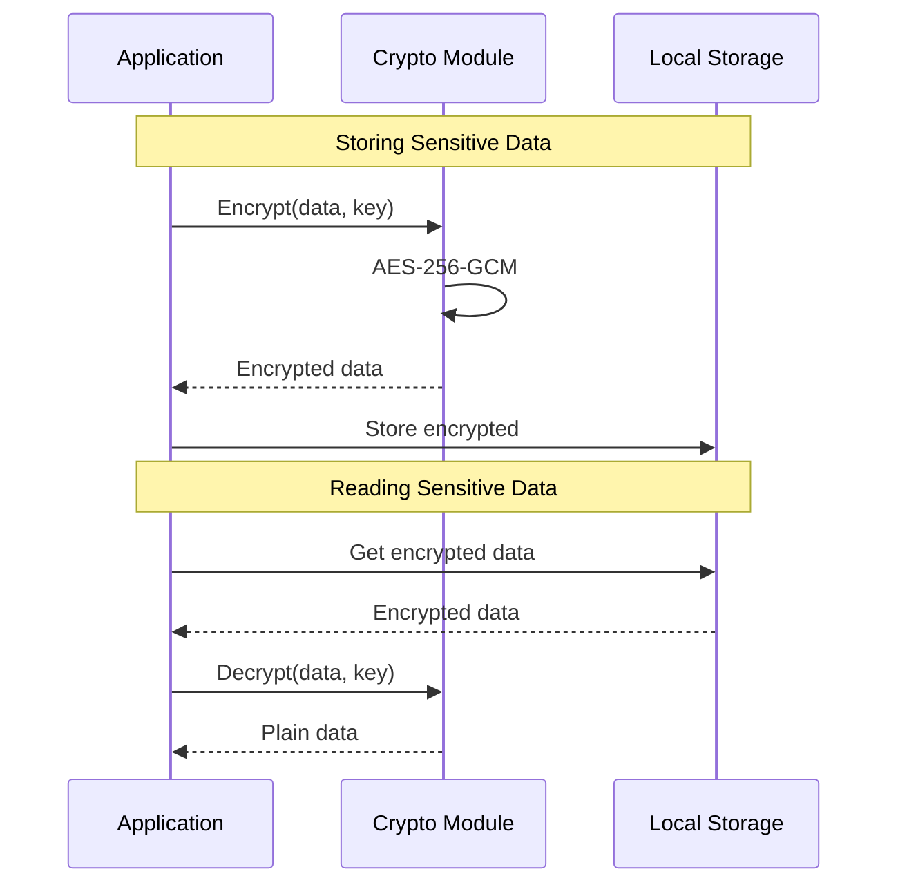
```mermaid
sequenceDiagram
    participant APP as Application
    participant CRYPTO as Crypto Module
    participant STORE as Local Storage

    Note over APP,STORE: Storing Sensitive Data

    APP->>CRYPTO: Encrypt(data, key)
    CRYPTO->>CRYPTO: AES-256-GCM
    CRYPTO-->>APP: Encrypted data
    APP->>STORE: Store encrypted

    Note over APP,STORE: Reading Sensitive Data

    APP->>STORE: Get encrypted data
    STORE-->>APP: Encrypted data
    APP->>CRYPTO: Decrypt(data, key)
    CRYPTO-->>APP: Plain data
```

---

## Security Checklist

### Authentication

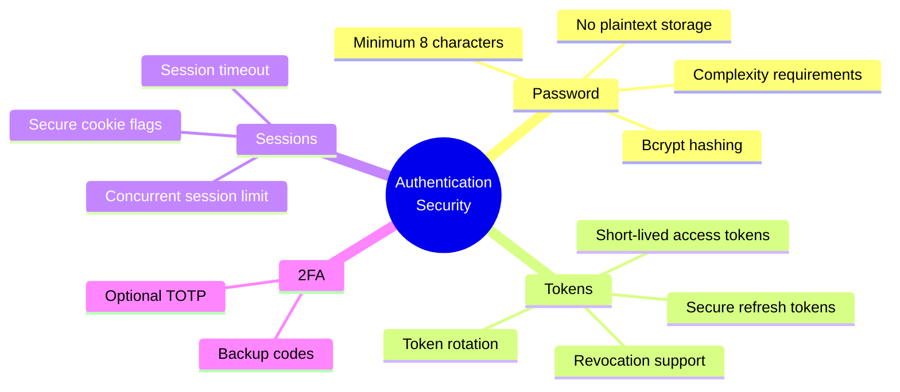
```mermaid
mindmap
    root((Authentication<br/>Security))
        Password
            Minimum 8 characters
            Complexity requirements
            Bcrypt hashing
            No plaintext storage
        Tokens
            Short-lived access tokens
            Secure refresh tokens
            Token rotation
            Revocation support
        Sessions
            Secure cookie flags
            Session timeout
            Concurrent session limit
        2FA
            Optional TOTP
            Backup codes
```

### API Security

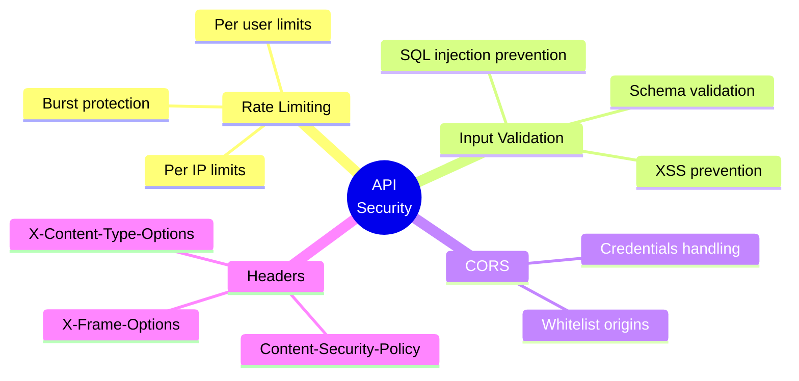
```mermaid
mindmap
    root((API<br/>Security))
        Rate Limiting
            Per user limits
            Per IP limits
            Burst protection
        Input Validation
            Schema validation
            SQL injection prevention
            XSS prevention
        CORS
            Whitelist origins
            Credentials handling
        Headers
            Content-Security-Policy
            X-Frame-Options
            X-Content-Type-Options
```

---

## Audit Logging

### Audit Log Structure

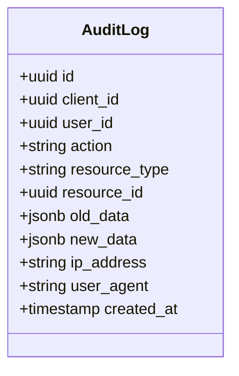
```mermaid
classDiagram
    class AuditLog {
        +uuid id
        +uuid client_id
        +uuid user_id
        +string action
        +string resource_type
        +uuid resource_id
        +jsonb old_data
        +jsonb new_data
        +string ip_address
        +string user_agent
        +timestamp created_at
    }
```

### Logged Actions

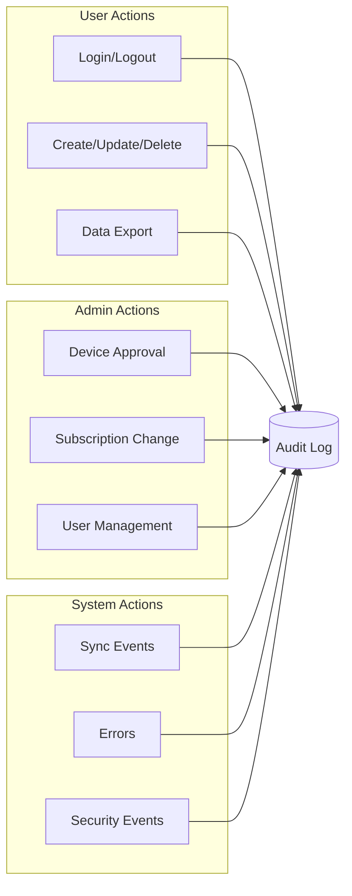
```mermaid
flowchart LR
    subgraph "User Actions"
        LOGIN[Login/Logout]
        CRUD[Create/Update/Delete]
        EXPORT[Data Export]
    end

    subgraph "Admin Actions"
        APPROVE[Device Approval]
        SUB_CHANGE[Subscription Change]
        USER_MGMT[User Management]
    end

    subgraph "System Actions"
        SYNC[Sync Events]
        ERROR[Errors]
        SECURITY[Security Events]
    end

    LOGIN --> AUDIT[(Audit Log)]
    CRUD --> AUDIT
    EXPORT --> AUDIT
    APPROVE --> AUDIT
    SUB_CHANGE --> AUDIT
    USER_MGMT --> AUDIT
    SYNC --> AUDIT
    ERROR --> AUDIT
    SECURITY --> AUDIT
```
