# 🚀 Deployment Guide

## Deployment Architecture


---

## Environment Setup

### Environment Variables


**.env.example:**

```bash
# Supabase
VITE_SUPABASE_URL=https://xxxxx.supabase.co
VITE_SUPABASE_ANON_KEY=eyJxxxxx

# App
VITE_APP_ENV=development
VITE_APP_NAME=محلي POS
VITE_APP_VERSION=1.0.0

# Updates
VITE_UPDATE_URL=https://updates.example.com

# Features
VITE_ENABLE_DEVTOOLS=true
VITE_ENABLE_LOGGING=true
```

---

## Supabase Setup

### Initial Setup Flow


### Migration Strategy


---

## Build Process

### Electron Build Flow


### Build Configuration

**package.json build config:**

```json
{
  "build": {
    "appId": "com.mahali.pos",
    "productName": "محلي POS",
    "directories": {
      "output": "release"
    },
    "files": ["dist/**/*", "dist-electron/**/*"],
    "win": {
      "target": ["nsis", "msi"],
      "icon": "public/icon.ico"
    },
    "mac": {
      "target": ["dmg", "pkg"],
      "icon": "public/icon.icns",
      "category": "public.app-category.business"
    },
    "linux": {
      "target": ["AppImage", "deb"],
      "icon": "public/icon.png",
      "category": "Office"
    },
    "nsis": {
      "oneClick": false,
      "allowToChangeInstallationDirectory": true,
      "installerIcon": "public/icon.ico",
      "uninstallerIcon": "public/icon.ico"
    },
    "publish": {
      "provider": "generic",
      "url": "https://updates.example.com"
    }
  }
}
```

---

## Auto-Update System

### Update Flow


### Update Server Structure

```
updates.example.com/
├── latest.yml                 # Latest version info
├── latest-mac.yml
├── latest-linux.yml
├── releases/
│   ├── v1.0.0/
│   │   ├── محلي-POS-1.0.0-win.exe
│   │   ├── محلي-POS-1.0.0-mac.dmg
│   │   └── محلي-POS-1.0.0-linux.AppImage
│   └── v2.0.0/
│       ├── محلي-POS-2.0.0-win.exe
│       ├── محلي-POS-2.0.0-mac.dmg
│       └── محلي-POS-2.0.0-linux.AppImage
└── release-notes/
    ├── v1.0.0.md
    └── v2.0.0.md
```

**latest.yml example:**

```yaml
version: 2.0.0
releaseDate: 2025-12-15
releaseNotes: |
  ## What's New
  - Feature A
  - Feature B
  ## Bug Fixes
  - Fix X
  - Fix Y
mandatory: false
gracePeriodDays: 7
minSupportedVersion: 1.5.0
files:
  - url: releases/v2.0.0/محلي-POS-2.0.0-win.exe
    sha512: xxxxx
    size: 85000000
```

---

## CI/CD Pipeline

### GitHub Actions Workflow


**.github/workflows/release.yml:**

```yaml
name: Release

on:
  push:
    tags:
      - "v*"

jobs:
  build:
    strategy:
      matrix:
        os: [windows-latest, macos-latest, ubuntu-latest]

    runs-on: ${{ matrix.os }}

    steps:
      - uses: actions/checkout@v4

      - uses: actions/setup-node@v4
        with:
          node-version: 20

      - name: Install dependencies
        run: npm ci

      - name: Build
        run: npm run build

      - name: Build Electron
        run: npm run electron:build
        env:
          GH_TOKEN: ${{ secrets.GH_TOKEN }}

      - name: Upload artifacts
        uses: actions/upload-artifact@v4
        with:
          name: release-${{ matrix.os }}
          path: release/*

  release:
    needs: build
    runs-on: ubuntu-latest
    steps:
      - name: Download artifacts
        uses: actions/download-artifact@v4

      - name: Create Release
        uses: softprops/action-gh-release@v1
        with:
          files: release-*/*
```

---

## Database Backup

### Backup Strategy


**Retention Policy:**
| Backup Type | Retention |
|-------------|-----------|
| Daily | 7 days |
| Weekly | 4 weeks |
| Monthly | 12 months |

---

## Monitoring

### Monitoring Stack

```mermaid
graph TB
    subgraph "Application"
        APP[محلي POS]
        LOGS[Application Logs]
        ERRORS[Error Tracking]
    end

    subgraph "Supabase"
        DB_METRICS[Database Metrics]
        AUTH_LOGS[Auth Logs]
        FUNC_LOGS[Function Logs]
    end

    subgraph "Monitoring Services"
        SENTRY[Sentry - Errors]
        ANALYTICS[Analytics]
        UPTIME[Uptime Monitor]
    end

    APP --> LOGS --> SENTRY
    APP --> ERRORS --> SENTRY
    APP --> ANALYTICS

    DB_METRICS --> SENTRY
    AUTH_LOGS --> SENTRY
    FUNC_LOGS --> SENTRY

    APP --> UPTIME
```



### Health Checks


---

## Scaling Considerations

### Supabase Scaling


### Performance Targets

| Metric            | Target  |
| ----------------- | ------- |
| API Response Time | < 200ms |
| Sync Operation    | < 5s    |
| App Launch        | < 3s    |
| Invoice Creation  | < 500ms |

---

## Disaster Recovery

### Recovery Plan


### RTO & RPO

| Scenario         | RTO     | RPO    |
| ---------------- | ------- | ------ |
| Database failure | 1 hour  | 1 hour |
| Application bug  | 30 min  | 0      |
| Full outage      | 4 hours | 1 hour |

---

## Checklist

### Pre-Deployment

- [ ] All tests passing
- [ ] Code reviewed
- [ ] Environment variables set
- [ ] Database migrations tested
- [ ] Backup verified

### Deployment

- [ ] Build successful
- [ ] Artifacts signed
- [ ] Update server configured
- [ ] Release notes written

### Post-Deployment

- [ ] Health checks passing
- [ ] Monitoring active
- [ ] User notifications sent
- [ ] Documentation updated
