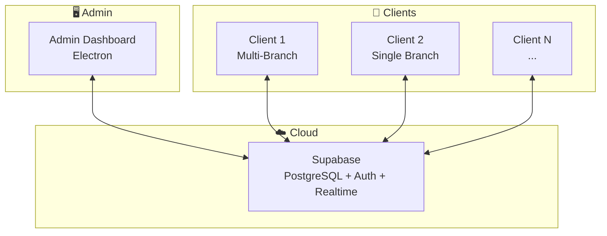

# 📖 Documentation Index

## محلي POS - System Documentation

### Quick Navigation

| Document                                          | Description                        |
| ------------------------------------------------- | ---------------------------------- |
| [00-Overview](./00-overview.md)                   | نظرة عامة على المشروع              |
| [01-Architecture](./01-architecture.md)           | البنية التقنية والتصميم            |
| [02-Database Schema](./02-database-schema.md)     | مخطط قاعدة البيانات                |
| [03-Sync Strategy](./03-sync-strategy.md)         | استراتيجية المزامنة Online/Offline |
| [04-Security](./04-security.md)                   | الأمان والحماية                    |
| [05-Admin System](./05-admin-system.md)           | نظام الإدارة المركزي               |
| [06-Client System](./06-client-system.md)         | نظام العميل (POS)                  |
| [07-API Reference](./07-api-reference.md)         | مرجع الـ APIs                      |
| [08-Project Structure](./08-project-structure.md) | هيكل المشروع                       |
| [09-Deployment](./09-deployment.md)               | النشر والتحديثات                   |

---

## System Overview Diagram

---

## Key Features Summary

### 🏢 Admin System

- ✅ Dynamic Plans & Features
- ✅ Client Management
- ✅ Subscription Management
- ✅ Device Approval
- ✅ Full Data Access
- ✅ Multi-channel Notifications
- ✅ Comprehensive Reports

### 💼 Client System

- ✅ Multi-Branch Support
- ✅ Online/Offline Mode
- ✅ Auto Sync
- ✅ Feature-based Access
- ✅ Role-based Permissions
- ✅ Thermal & A4 Printing
- ✅ WhatsApp Integration

### 🔄 Sync System

- ✅ Real-time Sync (Online)
- ✅ Queue-based Sync (Offline)
- ✅ Conflict Resolution
- ✅ Configurable Sync Mode

### 🔐 Security

- ✅ Device Fingerprinting
- ✅ JWT Authentication
- ✅ Row Level Security
- ✅ Subscription Validation
- ✅ Encrypted Local Storage

---

## Technology Stack

| Layer             | Technology                   |
| ----------------- | ---------------------------- |
| Frontend          | React 18 + TypeScript + Vite |
| UI                | TailwindCSS + Shadcn/ui      |
| Desktop           | Electron                     |
| Database (Local)  | IndexedDB (Dexie.js)         |
| Database (Remote) | PostgreSQL (Supabase)        |
| Auth              | Supabase Auth                |
| Realtime          | Supabase Realtime            |
| Serverless        | Supabase Edge Functions      |

---

## Getting Started

### For Developers

1. Read [01-Architecture](./01-architecture.md)
2. Review [08-Project Structure](./08-project-structure.md)
3. Understand [03-Sync Strategy](./03-sync-strategy.md)

### For System Admin

1. Read [00-Overview](./00-overview.md)
2. Review [05-Admin System](./05-admin-system.md)
3. Follow [09-Deployment](./09-deployment.md)

---

## Version History

| Version | Date       | Changes               |
| ------- | ---------- | --------------------- |
| 1.0.0   | 2025-12-02 | Initial documentation |

---

## Contact

For questions or suggestions about this documentation, please contact the development team.
