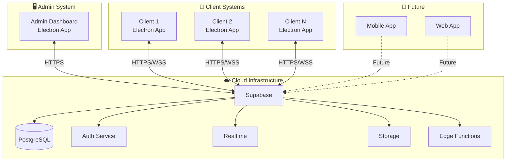
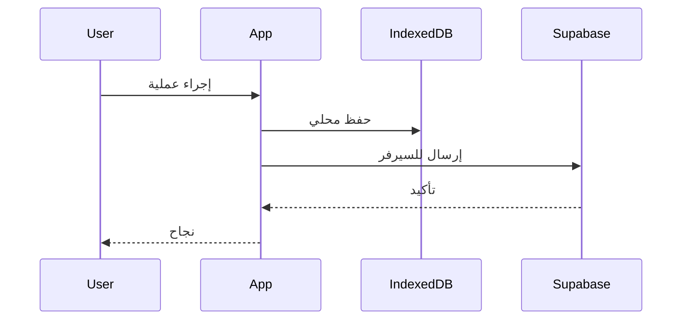
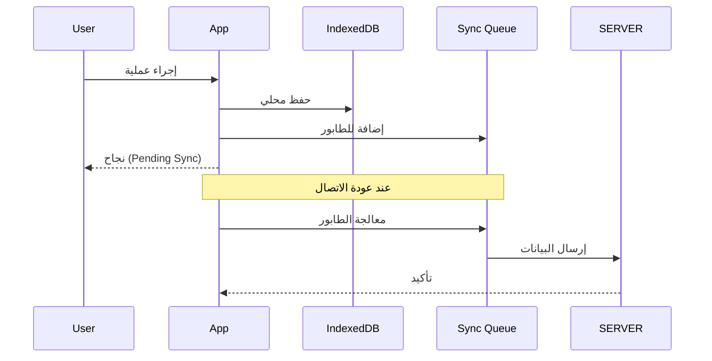
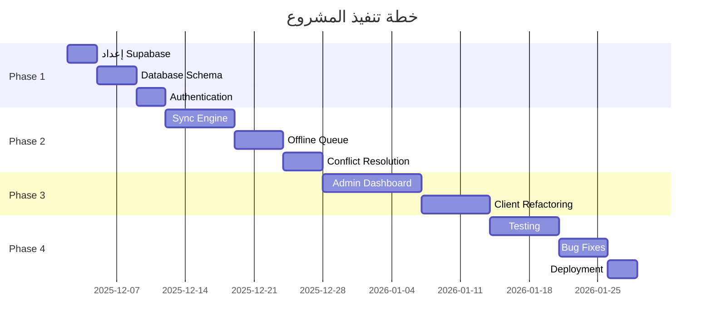

# 📋 نظرة عامة على المشروع

## 🎯 الرؤية

نظام نقاط بيع (POS) متكامل يعمل **Online/Offline** مع نظام إدارة مركزي للاشتراكات والعملاء.

---

## 🏗️ المكونات الرئيسية



---

## 📊 الميزات الرئيسية

### نظام الإدارة (Admin)

| الميزة              | الوصف                            |
| ------------------- | -------------------------------- |
| 👥 إدارة العملاء    | إضافة، تعديل، تعليق، حذف         |
| 📦 إدارة الباقات    | باقات Dynamic مع تحديد الميزات   |
| 💳 إدارة الاشتراكات | تفعيل، تجديد، إلغاء              |
| 📱 إدارة الأجهزة    | موافقة على الأجهزة، تغيير الجهاز |
| 📊 التقارير         | تقارير شاملة لكل العملاء         |
| 📢 التواصل          | إشعارات، رسائل، تحديثات          |
| 💰 المدفوعات        | يدوي + بوابات دفع                |

### نظام العميل (Client)

| الميزة        | الوصف                     |
| ------------- | ------------------------- |
| 🛒 نقطة البيع | POS متكامل                |
| 📦 المخزون    | إدارة المنتجات والكميات   |
| 👥 العملاء    | إدارة عملاء المحل         |
| 👔 الموظفين   | إدارة الموظفين والصلاحيات |
| 🏢 الفروع     | إدارة فروع متعددة         |
| 📊 التقارير   | تقارير المبيعات والمخزون  |
| 📱 WhatsApp   | تكامل واتساب              |
| 🔄 المزامنة   | Online/Offline Sync       |

---

## 🔄 أنماط العمل

### Online Mode



### Offline Mode



---

## 📅 مراحل التنفيذ



---

## 📁 هيكل الوثائق

```
docs/
├── 00-overview.md           # هذا الملف
├── 01-architecture.md       # البنية التقنية
├── 02-database-schema.md    # مخطط قاعدة البيانات
├── 03-sync-strategy.md      # استراتيجية المزامنة
├── 04-security.md           # الأمان والحماية
├── 05-admin-system.md       # نظام الإدارة
├── 06-client-system.md      # نظام العميل
├── 07-api-reference.md      # مرجع الـ APIs
├── 08-project-structure.md  # هيكل المشروع
└── 09-deployment.md         # النشر والتحديثات
```
