# 🏗️ System Architecture

## High-Level Architecture

```mermaid
graph TB
    subgraph "☁️ SUPABASE CLOUD"
        subgraph "Database Layer"
            PG[(PostgreSQL)]
            RLS[Row Level Security]
        end

        subgraph "Services"
            AUTH[Authentication]
            RT[Realtime<br/>WebSocket]
            STORE[Storage<br/>Files/Images]
            EDGE[Edge Functions<br/>Serverless]
        end
    end

    subgraph "🖥️ ADMIN APPLICATION"
        ADMIN_UI[Admin UI<br/>React + Vite]
        ADMIN_ELECTRON[Electron Main]
    end

    subgraph "💼 CLIENT APPLICATION"
        CLIENT_UI[Client UI<br/>React + Vite]
        CLIENT_ELECTRON[Electron Main]
        IDB[(IndexedDB<br/>Local Storage)]
        SYNC[Sync Engine]
        QUEUE[Offline Queue]
    end

    PG --- RLS
    AUTH --> PG
    RT --> PG
    EDGE --> PG

    ADMIN_UI --> ADMIN_ELECTRON
    ADMIN_ELECTRON <-->|HTTPS| AUTH
    ADMIN_ELECTRON <-->|HTTPS| PG

    CLIENT_UI --> CLIENT_ELECTRON
    CLIENT_ELECTRON <--> IDB
    CLIENT_ELECTRON <--> SYNC
    SYNC <--> QUEUE
    SYNC <-->|HTTPS/WSS| RT
    SYNC <-->|HTTPS| PG
    CLIENT_ELECTRON <-->|HTTPS| AUTH
```

---

## Clean Architecture Layers

---

## Data Flow Architecture

```mermaid
flowchart LR
    subgraph "User Action"
        A[👤 User]
    end

    subgraph "Presentation"
        B[Component]
        C[Hook]
    end

    subgraph "Domain"
        D[Use Case]
        E[Entity]
    end

    subgraph "Infrastructure"
        F[Repository]
        G[(Local DB)]
        H[(Remote DB)]
    end

    A -->|interacts| B
    B -->|calls| C
    C -->|executes| D
    D -->|creates/updates| E
    D -->|persists| F
    F -->|saves| G
    F -->|syncs| H
```

---

## Component Architecture

---

## Authentication Flow

---

## Multi-Tenant Architecture

```mermaid
graph TB
    subgraph "Super Admin"
        SA[Admin Dashboard]
    end

    subgraph "Client A - محلات أحمد"
        CA_MAIN[الفرع الرئيسي]
        CA_B1[فرع المعادي]
        CA_B2[فرع مدينة نصر]
    end

    subgraph "Client B - مطاعم محمد"
        CB_MAIN[الفرع الرئيسي]
        CB_B1[فرع الدقي]
    end

    subgraph "Client C - سوبر ماركت"
        CC_MAIN[فرع واحد]
    end

    subgraph "Supabase"
        DB[(Database)]
        RLS{Row Level<br/>Security}
    end

    SA -->|Full Access| DB

    CA_MAIN --> RLS
    CA_B1 --> RLS
    CA_B2 --> RLS

    CB_MAIN --> RLS
    CB_B1 --> RLS

    CC_MAIN --> RLS

    RLS -->|Filtered by client_id| DB
```

---

## Technology Stack

```mermaid
mindmap
    root((محلي POS))
        Frontend
            React 18
            TypeScript
            Vite
            TailwindCSS
            Shadcn/ui
            React Router
            React Query
        Desktop
            Electron
            IPC Communication
            Auto Updater
        Local Storage
            IndexedDB
            Dexie.js
        Backend
            Supabase
                PostgreSQL
                Auth
                Realtime
                Storage
                Edge Functions
        Integrations
            WhatsApp API
            Payment Gateways
            SMS Services
            Email Services
```

