# 🗄️ Database Schema

## Entity Relationship Diagram

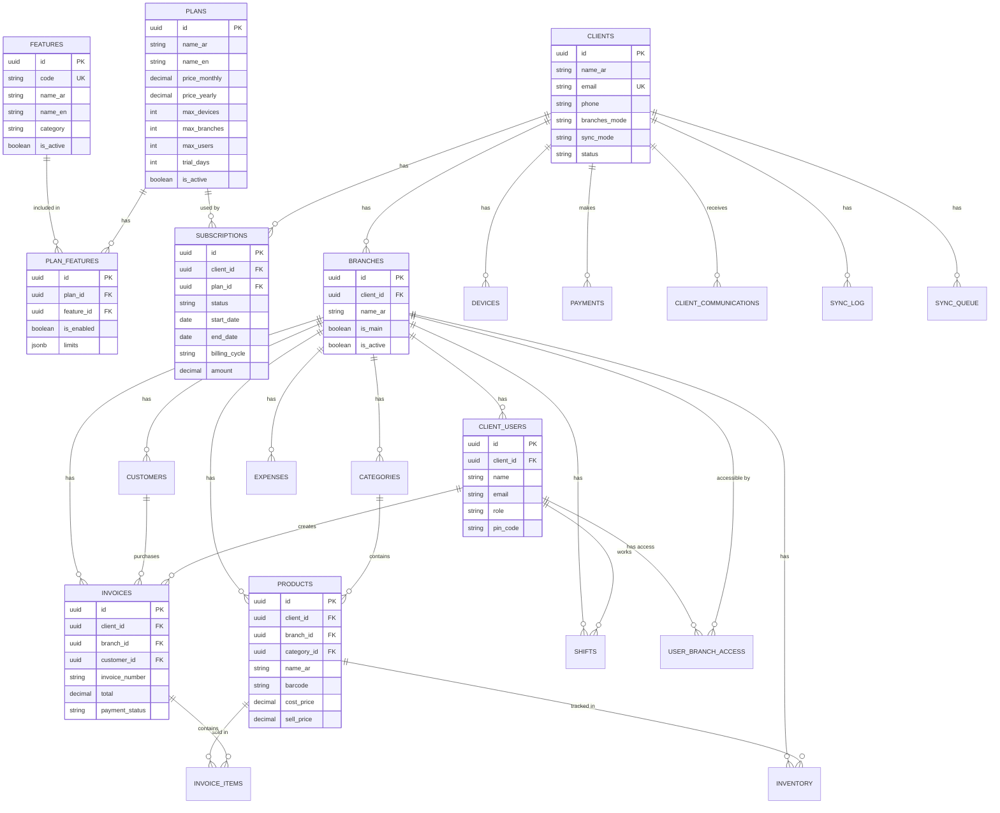

---

## Admin Tables Schema

### features (الميزات)

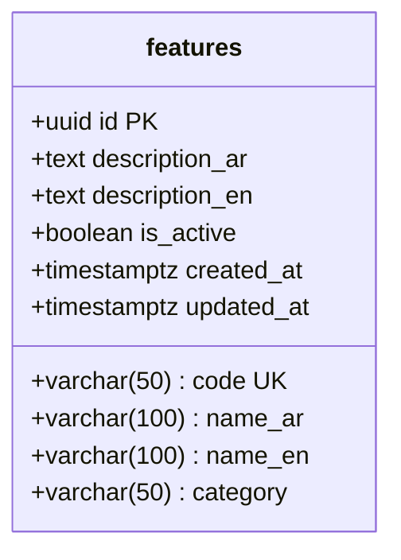

**القيم الافتراضية للميزات:**
| code | name_ar | category |
|------|---------|----------|
| pos | نقطة البيع | core |
| inventory | المخزون | core |
| customers | العملاء | core |
| employees | الموظفين | core |
| reports_basic | التقارير الأساسية | core |
| reports_advanced | التقارير المتقدمة | advanced |
| multi_branch | تعدد الفروع | advanced |
| whatsapp | تكامل واتساب | addon |
| promotions | العروض والخصومات | addon |
| installments | الأقساط | addon |

---

### plans (الباقات)

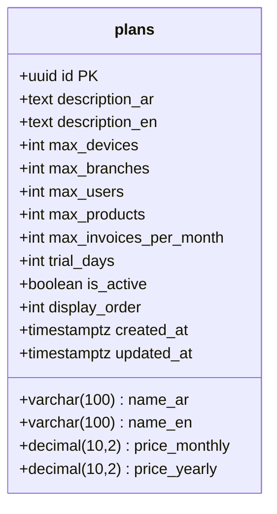

---

### clients (العملاء)

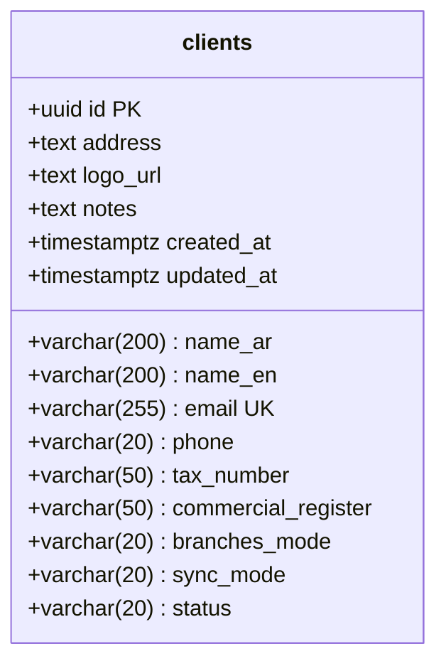

**branches_mode values:**

- `independent` - كل فرع مستقل
- `shared` - فروع مرتبطة (منتجات مشتركة)

**sync_mode values:**

- `auto` - مزامنة تلقائية
- `manual` - مزامنة يدوية
- `semi-auto` - إشعار للمستخدم

**status values:**

- `pending` - في انتظار التفعيل
- `active` - نشط
- `suspended` - معلق
- `cancelled` - ملغي

---

### subscriptions (الاشتراكات)

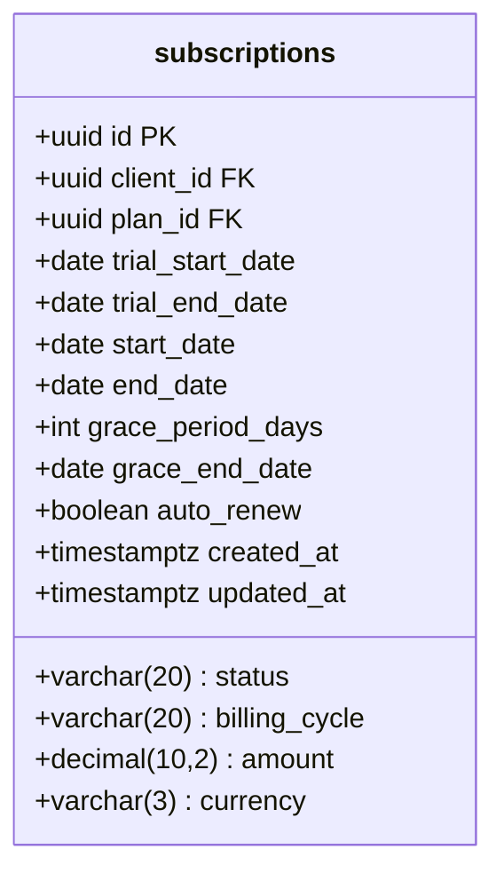

**status values:**

- `trial` - فترة تجريبية
- `active` - نشط
- `expired` - منتهي
- `cancelled` - ملغي
- `suspended` - معلق

---

### devices (الأجهزة)

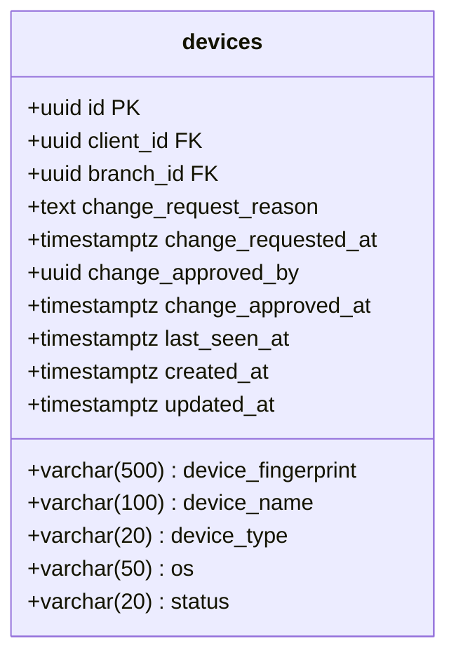

**Device Approval Flow:**

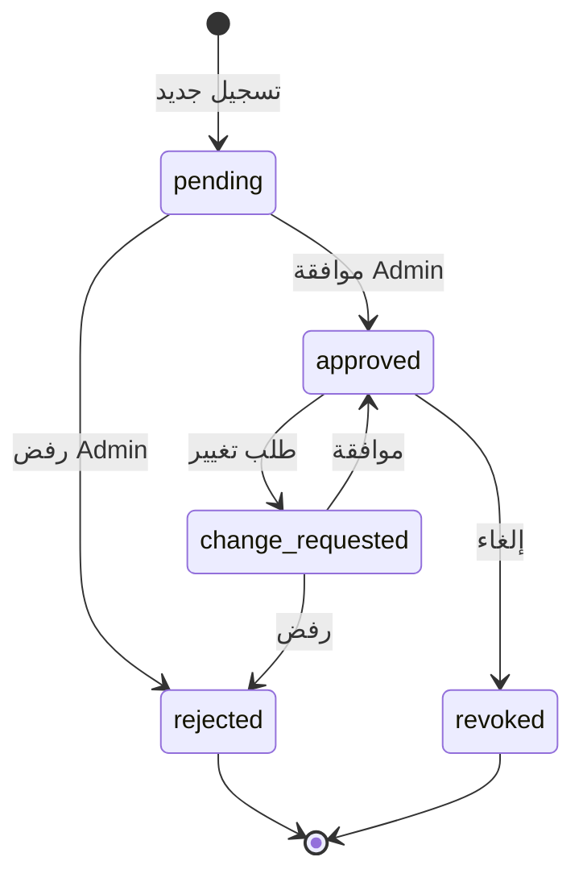

---

## Client Data Tables

### Syncable Entity Pattern

كل جدول بيانات العميل يتبع هذا النمط:

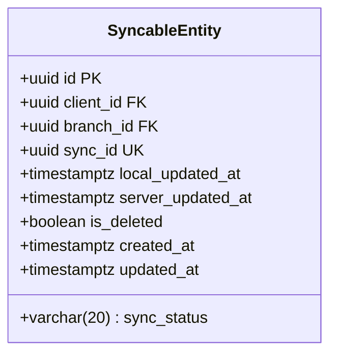

**sync_status values:**

- `synced` - متزامن
- `pending` - في انتظار المزامنة
- `conflict` - يوجد تعارض

---

### products (المنتجات)

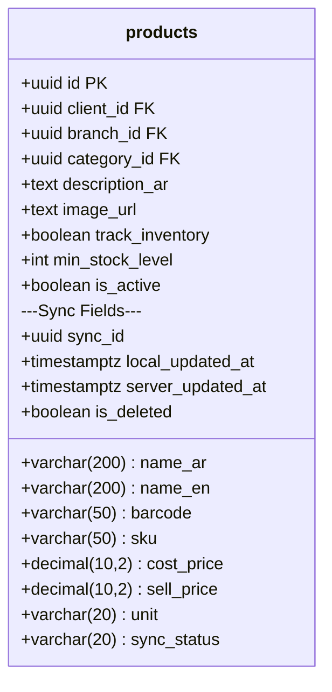

---

### invoices (الفواتير)

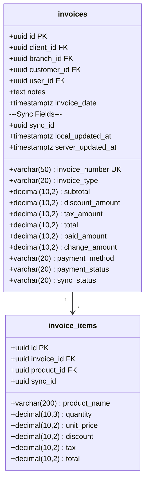

---

## Indexes Strategy

```sql
-- Performance Indexes
CREATE INDEX idx_products_client_branch ON products(client_id, branch_id);
CREATE INDEX idx_products_barcode ON products(client_id, barcode);
CREATE INDEX idx_products_category ON products(category_id);

CREATE INDEX idx_invoices_client_branch ON invoices(client_id, branch_id);
CREATE INDEX idx_invoices_date ON invoices(client_id, invoice_date);
CREATE INDEX idx_invoices_customer ON invoices(customer_id);

CREATE INDEX idx_inventory_product ON inventory(product_id);
CREATE INDEX idx_inventory_branch ON inventory(branch_id);

-- Sync Indexes
CREATE INDEX idx_products_sync ON products(client_id, sync_status, server_updated_at);
CREATE INDEX idx_invoices_sync ON invoices(client_id, sync_status, server_updated_at);
CREATE INDEX idx_sync_queue_status ON sync_queue(client_id, status, created_at);
```

---

## Row Level Security (RLS)

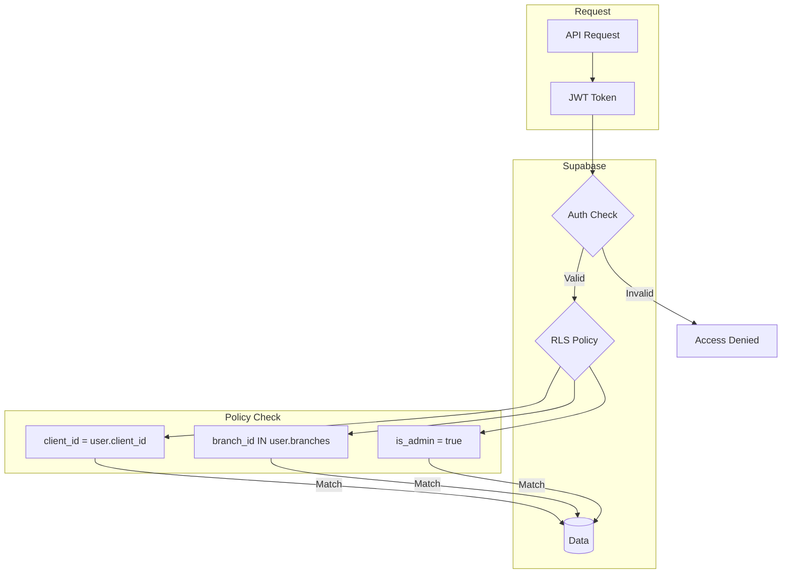

**Example RLS Policy:**

```sql
-- Clients can only see their own data
CREATE POLICY "clients_isolation" ON products
    FOR ALL
    USING (client_id = auth.jwt() ->> 'client_id');

-- Branch level access
CREATE POLICY "branch_access" ON products
    FOR ALL
    USING (
        branch_id IS NULL
        OR branch_id IN (
            SELECT branch_id
            FROM user_branch_access
            WHERE user_id = auth.uid()
        )
    );

-- Admin full access
CREATE POLICY "admin_full_access" ON products
    FOR ALL
    USING (
        (auth.jwt() ->> 'role') = 'super_admin'
    );
```
