# 🔄 Sync Strategy

## Overview

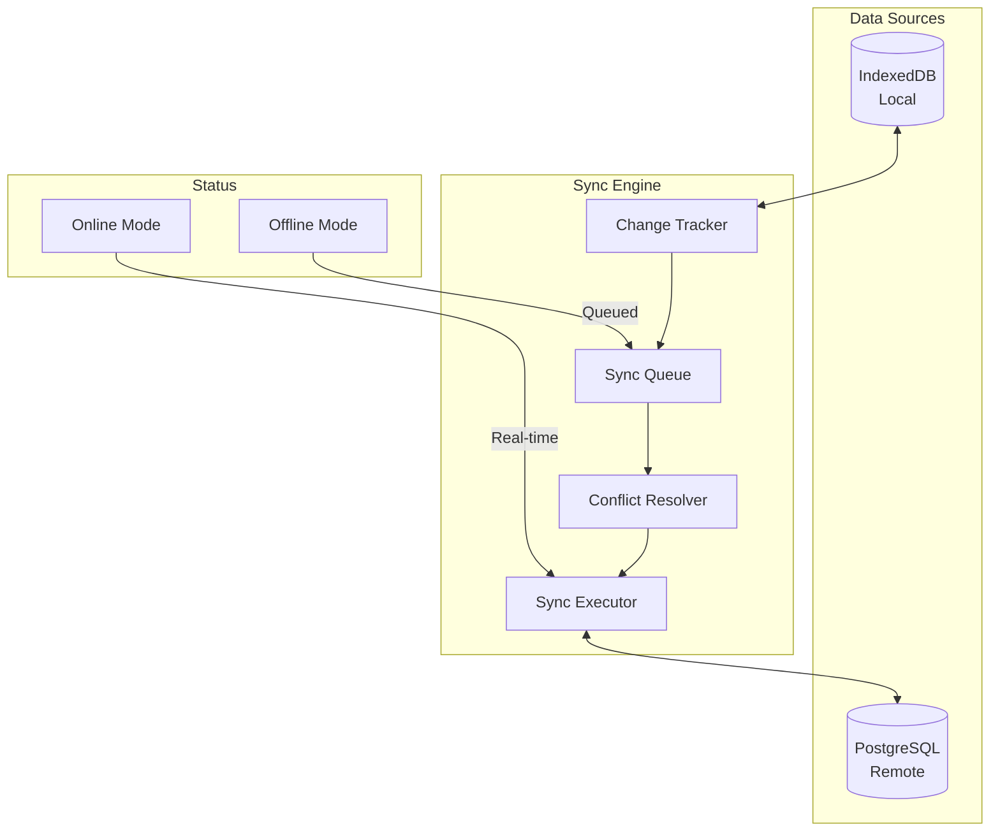
```mermaid
graph TB
    subgraph "Data Sources"
        LOCAL[(IndexedDB<br/>Local)]
        REMOTE[(PostgreSQL<br/>Remote)]
    end
    
    subgraph "Sync Engine"
        TRACKER[Change Tracker]
        QUEUE[Sync Queue]
        RESOLVER[Conflict Resolver]
        EXECUTOR[Sync Executor]
    end
    
    subgraph "Status"
        ONLINE[Online Mode]
        OFFLINE[Offline Mode]
    end
    
    LOCAL <--> TRACKER
    TRACKER --> QUEUE
    QUEUE --> RESOLVER
    RESOLVER --> EXECUTOR
    EXECUTOR <--> REMOTE
    
    ONLINE -->|Real-time| EXECUTOR
    OFFLINE -->|Queued| QUEUE
```

---

## Sync Modes

### 1. Auto Sync (تلقائي)
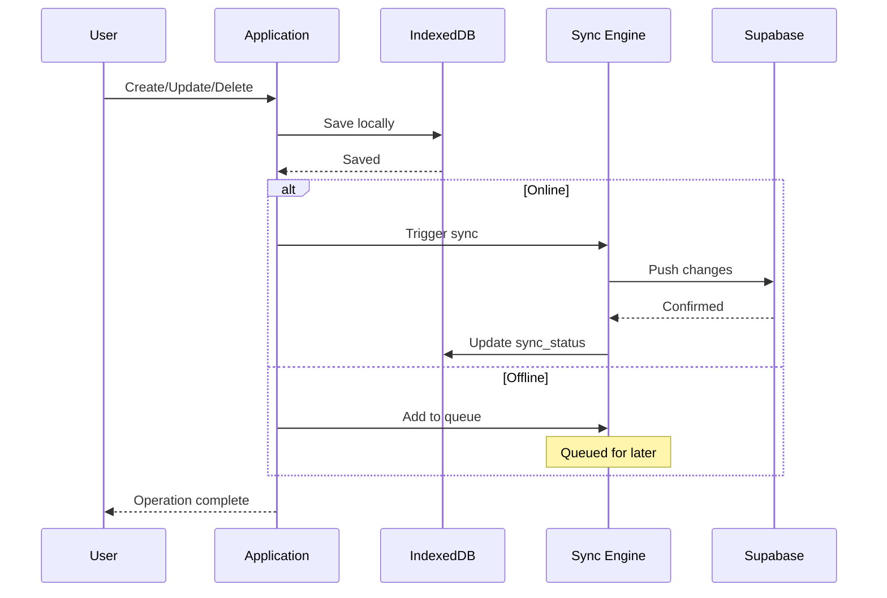
```mermaid
sequenceDiagram
    participant U as User
    participant APP as Application
    participant LOCAL as IndexedDB
    participant SYNC as Sync Engine
    participant SERVER as Supabase
    
    U->>APP: Create/Update/Delete
    APP->>LOCAL: Save locally
    LOCAL-->>APP: Saved
    
    alt Online
        APP->>SYNC: Trigger sync
        SYNC->>SERVER: Push changes
        SERVER-->>SYNC: Confirmed
        SYNC->>LOCAL: Update sync_status
    else Offline
        APP->>SYNC: Add to queue
        Note over SYNC: Queued for later
    end
    
    APP-->>U: Operation complete
```

### 2. Manual Sync (يدوي)
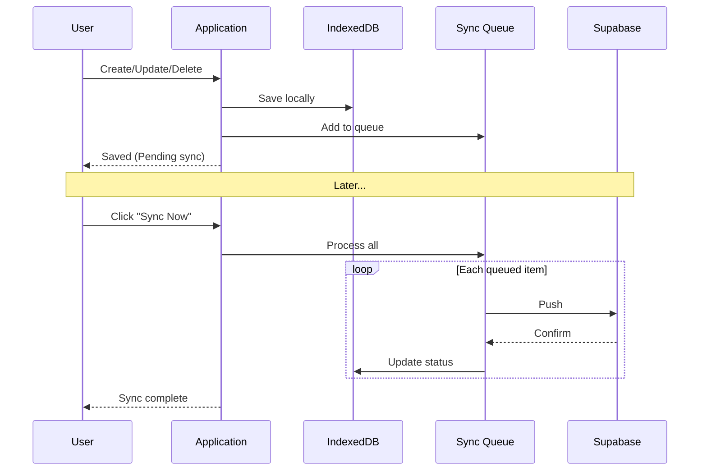
```mermaid
sequenceDiagram
    participant U as User
    participant APP as Application
    participant LOCAL as IndexedDB
    participant QUEUE as Sync Queue
    participant SERVER as Supabase
    
    U->>APP: Create/Update/Delete
    APP->>LOCAL: Save locally
    APP->>QUEUE: Add to queue
    APP-->>U: Saved (Pending sync)
    
    Note over U,SERVER: Later...
    
    U->>APP: Click "Sync Now"
    APP->>QUEUE: Process all
    
    loop Each queued item
        QUEUE->>SERVER: Push
        SERVER-->>QUEUE: Confirm
        QUEUE->>LOCAL: Update status
    end
    
    APP-->>U: Sync complete
```

### 3. Semi-Auto Sync (شبه تلقائي)
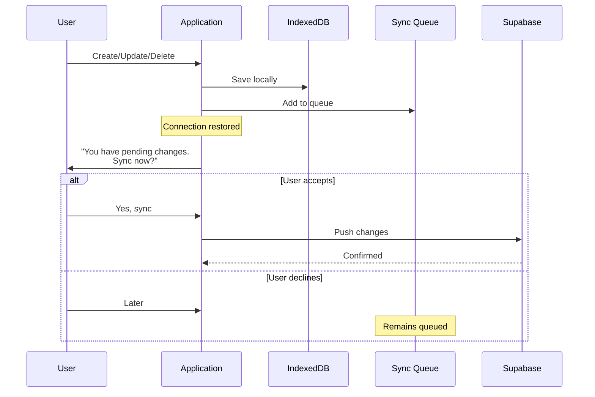
```mermaid
sequenceDiagram
    participant U as User
    participant APP as Application
    participant LOCAL as IndexedDB
    participant QUEUE as Sync Queue
    participant SERVER as Supabase
    
    U->>APP: Create/Update/Delete
    APP->>LOCAL: Save locally
    APP->>QUEUE: Add to queue
    
    Note over APP: Connection restored
    
    APP->>U: "You have pending changes.<br/>Sync now?"
    
    alt User accepts
        U->>APP: Yes, sync
        APP->>SERVER: Push changes
        SERVER-->>APP: Confirmed
    else User declines
        U->>APP: Later
        Note over QUEUE: Remains queued
    end
```

---

## Change Tracking

### Local Changes Detection
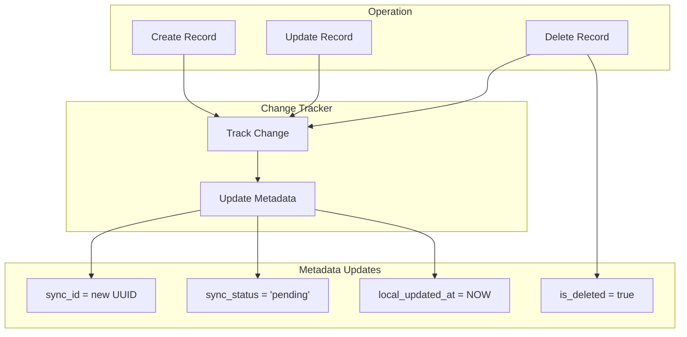
```mermaid
flowchart TD
    subgraph "Operation"
        CREATE[Create Record]
        UPDATE[Update Record]
        DELETE[Delete Record]
    end
    
    subgraph "Change Tracker"
        TRACK[Track Change]
        META[Update Metadata]
    end
    
    subgraph "Metadata Updates"
        SYNC_ID[sync_id = new UUID]
        STATUS[sync_status = 'pending']
        LOCAL_TS[local_updated_at = NOW]
        DELETED[is_deleted = true]
    end
    
    CREATE --> TRACK
    UPDATE --> TRACK
    DELETE --> TRACK
    
    TRACK --> META
    
    META --> SYNC_ID
    META --> STATUS
    META --> LOCAL_TS
    DELETE --> DELETED
```

### Sync Queue Structure
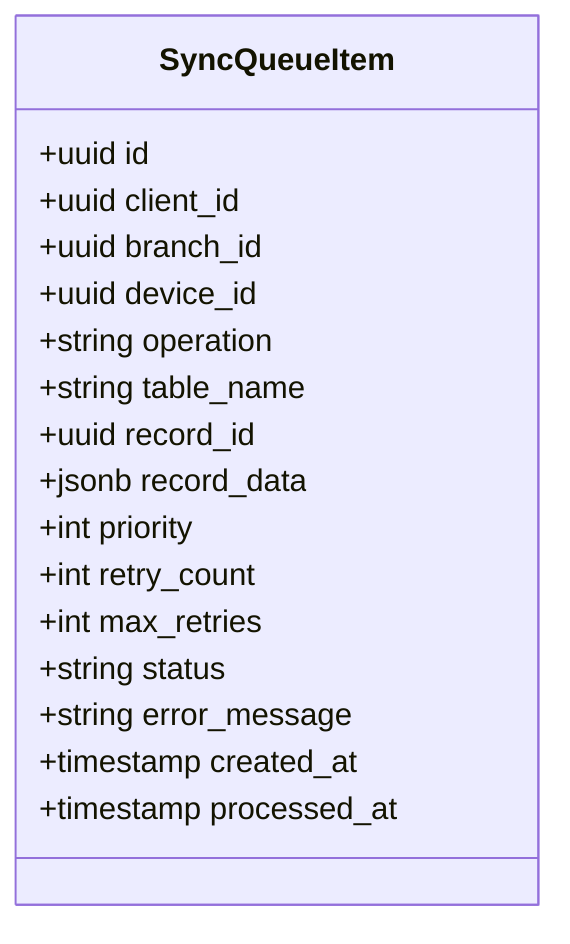
```mermaid
classDiagram
    class SyncQueueItem {
        +uuid id
        +uuid client_id
        +uuid branch_id
        +uuid device_id
        +string operation
        +string table_name
        +uuid record_id
        +jsonb record_data
        +int priority
        +int retry_count
        +int max_retries
        +string status
        +string error_message
        +timestamp created_at
        +timestamp processed_at
    }
```

**Priority Levels:**
| Priority | Table | Description |
|----------|-------|-------------|
| 1 (High) | invoices | فواتير - أهم البيانات |
| 2 | invoice_items | تفاصيل الفواتير |
| 3 | shifts | الورديات |
| 4 | inventory | المخزون |
| 5 | customers | العملاء |
| 6 (Low) | products, categories | المنتجات والتصنيفات |

---

## Conflict Resolution

### Conflict Detection
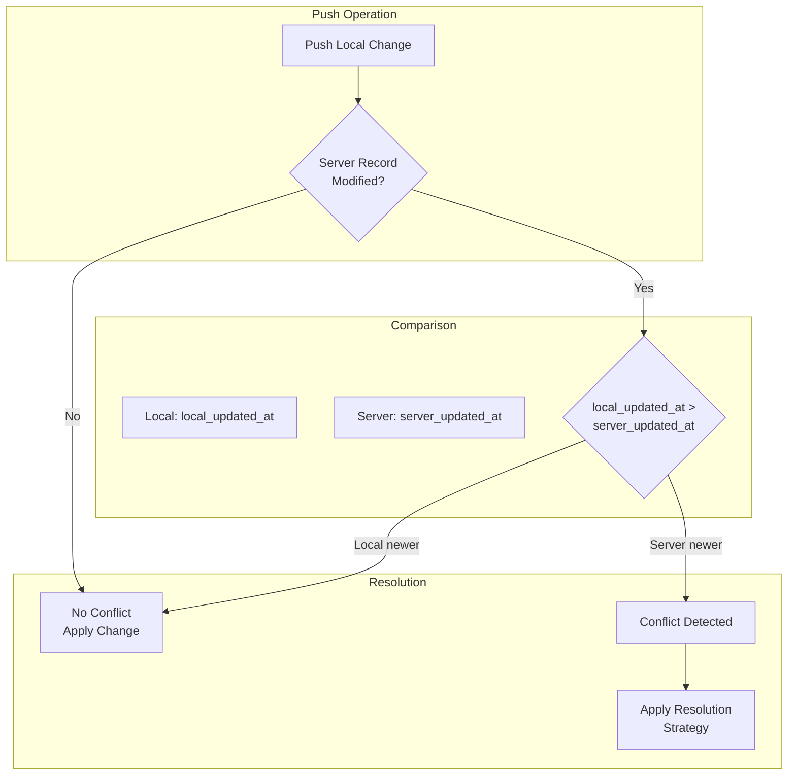
```mermaid
flowchart TD
    subgraph "Push Operation"
        PUSH[Push Local Change]
        CHECK{Server Record<br/>Modified?}
    end
    
    subgraph "Comparison"
        LOCAL_TS[Local: local_updated_at]
        SERVER_TS[Server: server_updated_at]
        COMPARE{local_updated_at ><br/>server_updated_at}
    end
    
    subgraph "Resolution"
        NO_CONFLICT[No Conflict<br/>Apply Change]
        CONFLICT[Conflict Detected]
        RESOLVE[Apply Resolution<br/>Strategy]
    end
    
    PUSH --> CHECK
    CHECK -->|No| NO_CONFLICT
    CHECK -->|Yes| COMPARE
    
    COMPARE -->|Local newer| NO_CONFLICT
    COMPARE -->|Server newer| CONFLICT
    
    CONFLICT --> RESOLVE
```

### Resolution Strategies

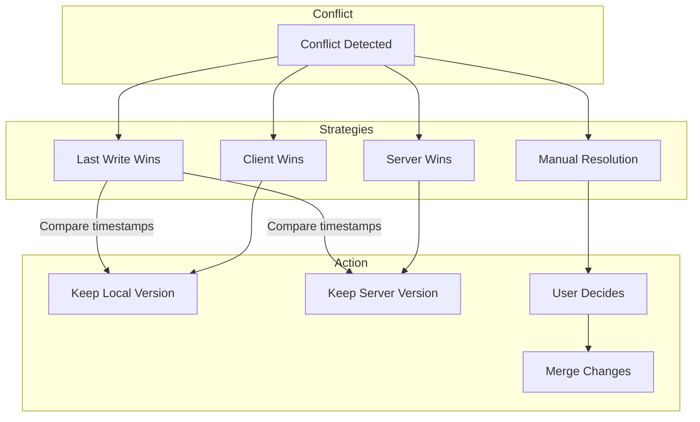
```mermaid
flowchart TD
    subgraph "Conflict"
        C[Conflict Detected]
    end
    
    subgraph "Strategies"
        LWW[Last Write Wins]
        SW[Server Wins]
        CW[Client Wins]
        MANUAL[Manual Resolution]
    end
    
    subgraph "Action"
        KEEP_LOCAL[Keep Local Version]
        KEEP_SERVER[Keep Server Version]
        MERGE[Merge Changes]
        USER_DECIDE[User Decides]
    end
    
    C --> LWW
    C --> SW
    C --> CW
    C --> MANUAL
    
    LWW -->|Compare timestamps| KEEP_LOCAL
    LWW -->|Compare timestamps| KEEP_SERVER
    SW --> KEEP_SERVER
    CW --> KEEP_LOCAL
    MANUAL --> USER_DECIDE
    USER_DECIDE --> MERGE
```

### Last Write Wins (Default)
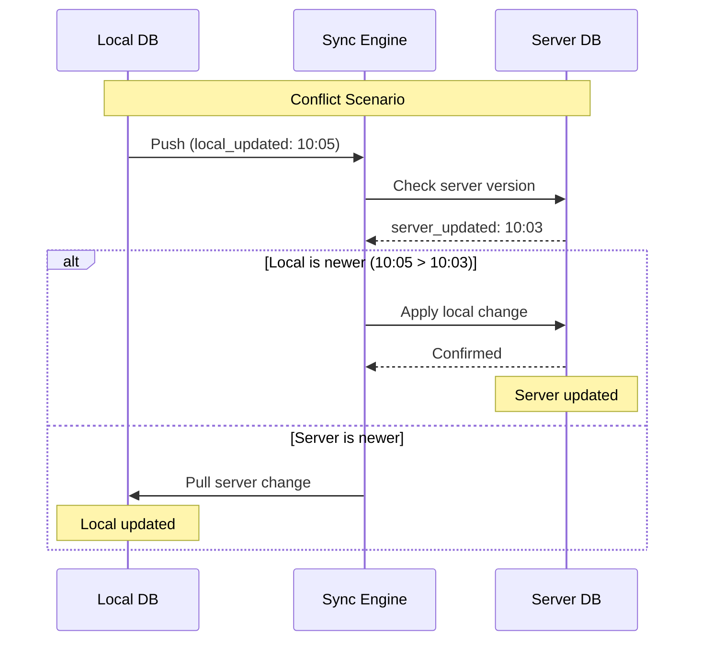
```mermaid
sequenceDiagram
    participant LOCAL as Local DB
    participant SYNC as Sync Engine
    participant SERVER as Server DB
    
    Note over LOCAL,SERVER: Conflict Scenario
    
    LOCAL->>SYNC: Push (local_updated: 10:05)
    SYNC->>SERVER: Check server version
    SERVER-->>SYNC: server_updated: 10:03
    
    alt Local is newer (10:05 > 10:03)
        SYNC->>SERVER: Apply local change
        SERVER-->>SYNC: Confirmed
        Note over SERVER: Server updated
    else Server is newer
        SYNC->>LOCAL: Pull server change
        Note over LOCAL: Local updated
    end
```

---

## Sync Process Flow

### Full Sync (Initial or Manual)
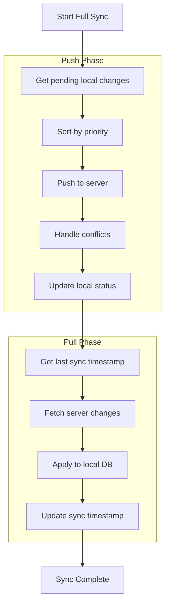
```mermaid
flowchart TD
    START[Start Full Sync]
    
    subgraph "Push Phase"
        P1[Get pending local changes]
        P2[Sort by priority]
        P3[Push to server]
        P4[Handle conflicts]
        P5[Update local status]
    end
    
    subgraph "Pull Phase"
        L1[Get last sync timestamp]
        L2[Fetch server changes]
        L3[Apply to local DB]
        L4[Update sync timestamp]
    end
    
    COMPLETE[Sync Complete]
    
    START --> P1
    P1 --> P2
    P2 --> P3
    P3 --> P4
    P4 --> P5
    P5 --> L1
    L1 --> L2
    L2 --> L3
    L3 --> L4
    L4 --> COMPLETE
```

### Incremental Sync (Real-time)
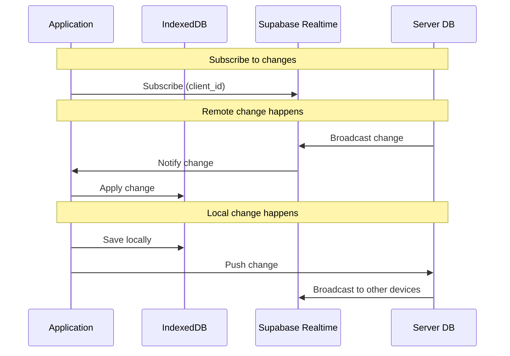
```mermaid
sequenceDiagram
    participant APP as Application
    participant LOCAL as IndexedDB
    participant RT as Supabase Realtime
    participant SERVER as Server DB
    
    Note over APP,SERVER: Subscribe to changes
    APP->>RT: Subscribe (client_id)
    
    Note over APP,SERVER: Remote change happens
    SERVER->>RT: Broadcast change
    RT->>APP: Notify change
    APP->>LOCAL: Apply change
    
    Note over APP,SERVER: Local change happens
    APP->>LOCAL: Save locally
    APP->>SERVER: Push change
    SERVER->>RT: Broadcast to other devices
```

---

## Offline Queue Processing

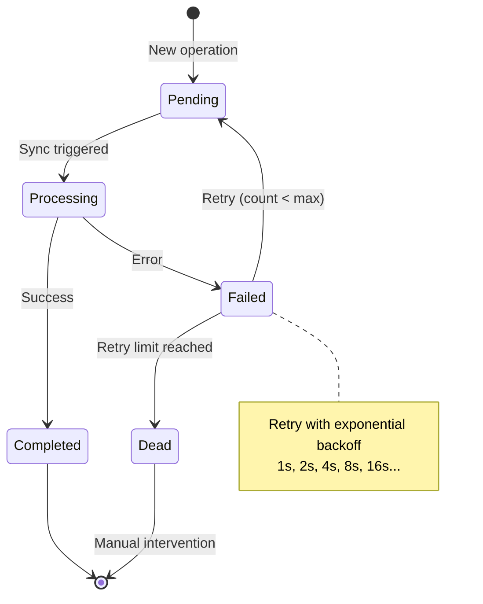
```mermaid
stateDiagram-v2
    [*] --> Pending: New operation
    
    Pending --> Processing: Sync triggered
    Processing --> Completed: Success
    Processing --> Failed: Error
    
    Failed --> Pending: Retry (count < max)
    Failed --> Dead: Retry limit reached
    
    Completed --> [*]
    Dead --> [*]: Manual intervention
    
    note right of Failed
        Retry with exponential backoff
        1s, 2s, 4s, 8s, 16s...
    end note
```

### Queue Processing Algorithm
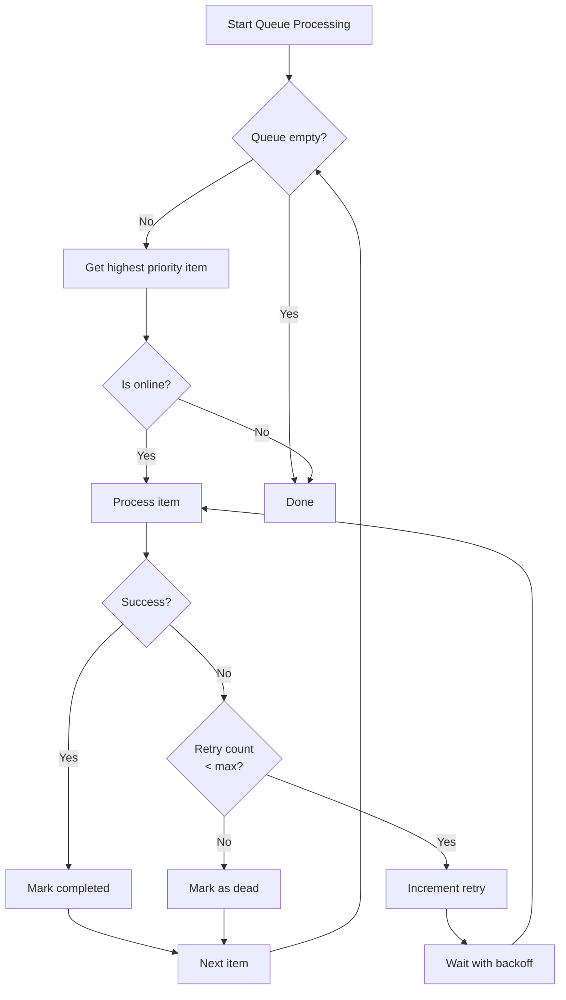
```mermaid
flowchart TD
    START[Start Queue Processing]
    
    CHECK{Queue empty?}
    GET[Get highest priority item]
    ONLINE{Is online?}
    
    PROCESS[Process item]
    SUCCESS{Success?}
    
    MARK_DONE[Mark completed]
    
    RETRY{Retry count<br/>< max?}
    INCREMENT[Increment retry]
    BACKOFF[Wait with backoff]
    MARK_DEAD[Mark as dead]
    
    NEXT[Next item]
    DONE[Done]
    
    START --> CHECK
    CHECK -->|Yes| DONE
    CHECK -->|No| GET
    GET --> ONLINE
    ONLINE -->|No| DONE
    ONLINE -->|Yes| PROCESS
    
    PROCESS --> SUCCESS
    SUCCESS -->|Yes| MARK_DONE
    SUCCESS -->|No| RETRY
    
    MARK_DONE --> NEXT
    NEXT --> CHECK
    
    RETRY -->|Yes| INCREMENT
    RETRY -->|No| MARK_DEAD
    INCREMENT --> BACKOFF
    BACKOFF --> PROCESS
    MARK_DEAD --> NEXT
```

---

## Data Integrity

### Checksum Verification
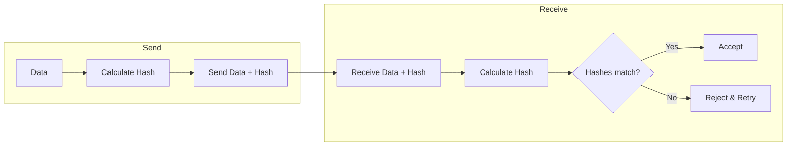
```mermaid
flowchart LR
    subgraph "Send"
        DATA1[Data]
        HASH1[Calculate Hash]
        SEND[Send Data + Hash]
    end
    
    subgraph "Receive"
        RECEIVE[Receive Data + Hash]
        HASH2[Calculate Hash]
        VERIFY{Hashes match?}
        ACCEPT[Accept]
        REJECT[Reject & Retry]
    end
    
    DATA1 --> HASH1
    HASH1 --> SEND
    SEND --> RECEIVE
    RECEIVE --> HASH2
    HASH2 --> VERIFY
    VERIFY -->|Yes| ACCEPT
    VERIFY -->|No| REJECT
```

### Transaction Integrity
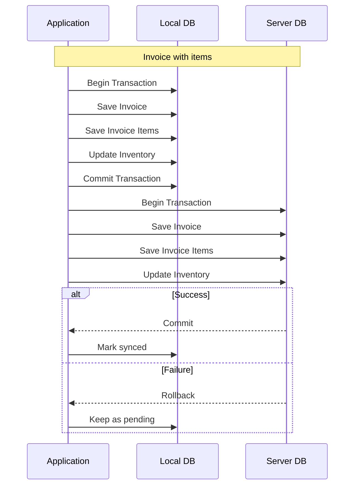
```mermaid
sequenceDiagram
    participant APP as Application
    participant LOCAL as Local DB
    participant SERVER as Server DB
    
    Note over APP,SERVER: Invoice with items
    
    APP->>LOCAL: Begin Transaction
    APP->>LOCAL: Save Invoice
    APP->>LOCAL: Save Invoice Items
    APP->>LOCAL: Update Inventory
    APP->>LOCAL: Commit Transaction
    
    APP->>SERVER: Begin Transaction
    APP->>SERVER: Save Invoice
    APP->>SERVER: Save Invoice Items
    APP->>SERVER: Update Inventory
    
    alt Success
        SERVER-->>APP: Commit
        APP->>LOCAL: Mark synced
    else Failure
        SERVER-->>APP: Rollback
        APP->>LOCAL: Keep as pending
    end
```

---

## Performance Optimization

### Batch Sync
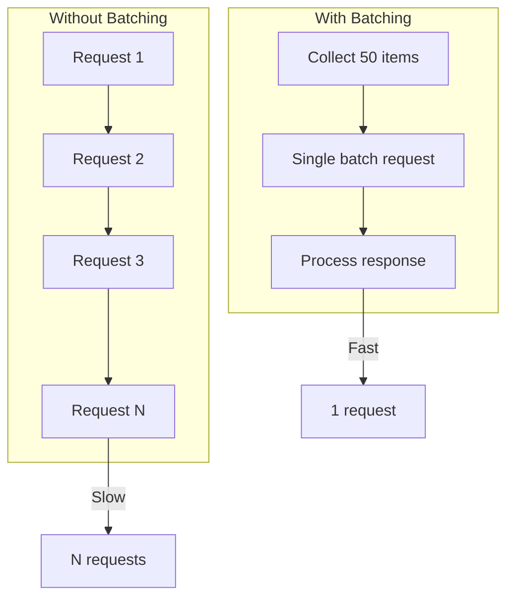
```mermaid
flowchart TD
    subgraph "Without Batching"
        A1[Request 1] --> A2[Request 2] --> A3[Request 3] --> A4[Request N]
    end
    
    subgraph "With Batching"
        B1[Collect 50 items]
        B2[Single batch request]
        B3[Process response]
    end
    
    A4 -->|Slow| RESULT1[N requests]
    B1 --> B2 --> B3 -->|Fast| RESULT2[1 request]
```

### Delta Sync
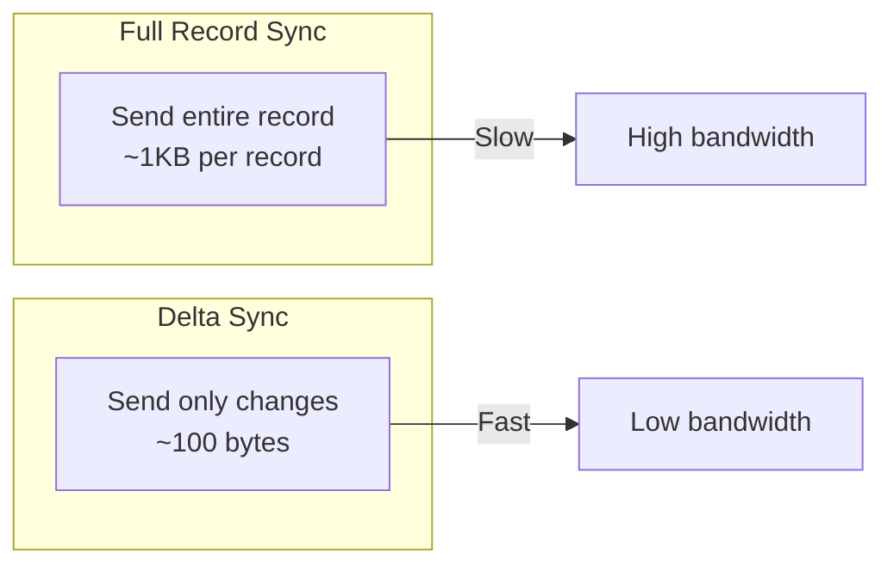
```mermaid
flowchart LR
    subgraph "Full Record Sync"
        FULL[Send entire record<br/>~1KB per record]
    end
    
    subgraph "Delta Sync"
        DELTA[Send only changes<br/>~100 bytes]
    end
    
    FULL -->|Slow| NET1[High bandwidth]
    DELTA -->|Fast| NET2[Low bandwidth]
```
