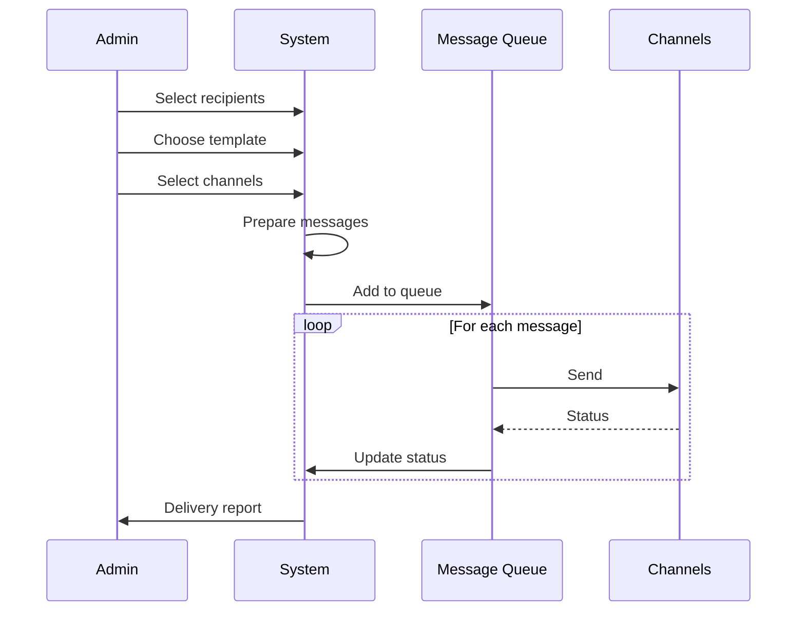

# 👑 Admin System

## Admin Dashboard Overview

---

## Dashboard Home

### Statistics Cards

### Dashboard Layout

---

## Clients Management

### Client Lifecycle

### Client Detail View

### Client Data Access (Support Mode)

---

## Plans Management

### Dynamic Plan Configuration

### Plan Comparison Matrix

---

## Subscriptions Management

### Subscription Dashboard

### Payment Processing

---

## Devices Management

### Device Approval Workflow

### Device Change Request

---

## Reports

### Revenue Analytics

### Client Analytics

### Usage Reports

---

## Communications

### Notification Center

### Bulk Messaging

---

## Admin Permissions

### Role-Based Access

