# 💼 Client System

## Client Application Overview

```mermaid
graph TB
    subgraph "Main Modules"
        POS[نقطة البيع<br/>POS]
        INV[المخزون<br/>Inventory]
        CUST[العملاء<br/>Customers]
        EMP[الموظفين<br/>Employees]
        FINANCE[المالية<br/>Finance]
        REPORTS[التقارير<br/>Reports]
        SETTINGS[الإعدادات<br/>Settings]
    end
    
    subgraph "Multi-Branch"
        BRANCH_MGR[إدارة الفروع]
        BRANCH_SWITCH[تبديل الفروع]
        BRANCH_REPORTS[تقارير موحدة]
    end
    
    subgraph "Sync & Status"
        SYNC[حالة المزامنة]
        OFFLINE[وضع Offline]
        ONLINE[وضع Online]
    end
    
    POS --> SYNC
    INV --> SYNC
    CUST --> SYNC
    FINANCE --> SYNC
```

---

## POS Module (نقطة البيع)

### POS Interface Layout
```mermaid
flowchart TB
    subgraph "Header"
        BRANCH[الفرع الحالي]
        SHIFT[الوردية]
        USER[المستخدم]
        SYNC_STATUS[حالة المزامنة]
    end
    
    subgraph "Main Area"
        subgraph "Products Panel"
            CATEGORIES[التصنيفات]
            PRODUCTS[المنتجات]
            SEARCH[البحث]
        end
        
        subgraph "Cart Panel"
            CART[السلة]
            TOTALS[الإجماليات]
            CUSTOMER[العميل]
        end
    end
    
    subgraph "Actions"
        PAY[الدفع]
        HOLD[تعليق]
        DISCOUNT[خصم]
        PRINT[طباعة]
    end
```

### Sale Flow
```mermaid
sequenceDiagram
    participant CASHIER as الكاشير
    participant POS as نقطة البيع
    participant LOCAL as Local DB
    participant SERVER as Server
    
    CASHIER->>POS: إضافة منتجات
    POS->>POS: حساب الإجمالي
    
    CASHIER->>POS: تحديد العميل (اختياري)
    CASHIER->>POS: تطبيق خصم (اختياري)
    
    CASHIER->>POS: الدفع
    POS->>POS: معالجة الدفع
    
    POS->>LOCAL: حفظ الفاتورة
    POS->>LOCAL: تحديث المخزون
    
    alt Online
        POS->>SERVER: مزامنة
        SERVER-->>POS: تأكيد
    else Offline
        POS->>LOCAL: إضافة للطابور
    end
    
    POS->>POS: طباعة الفاتورة
    POS-->>CASHIER: اكتمال البيع
```

### Hold & Recall (تعليق واستعادة)
```mermaid
stateDiagram-v2
    [*] --> Active: بدء فاتورة جديدة
    Active --> OnHold: تعليق الفاتورة
    OnHold --> Active: استعادة الفاتورة
    Active --> Completed: إتمام البيع
    OnHold --> Cancelled: إلغاء
    Completed --> [*]
    Cancelled --> [*]
```

---

## Inventory Module (المخزون)

### Inventory Management
```mermaid
graph TB
    subgraph "Products"
        ADD_PROD[إضافة منتج]
        EDIT_PROD[تعديل منتج]
        CATEGORIES[التصنيفات]
        UNITS[الوحدات]
    end
    
    subgraph "Stock"
        STOCK_IN[إضافة للمخزون]
        STOCK_OUT[سحب من المخزون]
        ADJUST[تعديل الكميات]
        COUNT[جرد المخزون]
    end
    
    subgraph "Alerts"
        LOW_STOCK[تنبيه نقص المخزون]
        EXPIRY[تنبيه انتهاء الصلاحية]
    end
    
    subgraph "Reports"
        STOCK_REPORT[تقرير المخزون]
        MOVEMENT[حركة المخزون]
        VALUATION[تقييم المخزون]
    end
```

### Stock Movement Flow
```mermaid
sequenceDiagram
    participant USER as المستخدم
    participant APP as التطبيق
    participant INV as المخزون
    participant LOG as سجل الحركة
    
    USER->>APP: حركة مخزون جديدة
    APP->>APP: التحقق من الكمية
    
    alt كمية كافية
        APP->>INV: تحديث الكمية
        APP->>LOG: تسجيل الحركة
        APP-->>USER: تم بنجاح
    else كمية غير كافية
        APP-->>USER: خطأ: كمية غير كافية
    end
```

### Branch Inventory (للفروع المرتبطة)
```mermaid
graph TB
    subgraph "Shared Products Mode"
        MASTER[قائمة المنتجات الرئيسية]
        
        subgraph "Branch A"
            INV_A[مخزون فرع A]
        end
        
        subgraph "Branch B"
            INV_B[مخزون فرع B]
        end
        
        subgraph "Branch C"
            INV_C[مخزون فرع C]
        end
    end
    
    MASTER --> INV_A
    MASTER --> INV_B
    MASTER --> INV_C
    
    subgraph "Stock Transfer"
        TRANSFER[نقل بين الفروع]
    end
    
    INV_A <-->|Transfer| INV_B
    INV_B <-->|Transfer| INV_C
```

---

## Multi-Branch Management

### Branch Modes
```mermaid
graph TB
    subgraph "Independent Mode"
        I_B1[فرع 1<br/>منتجات مستقلة<br/>عملاء مستقلين]
        I_B2[فرع 2<br/>منتجات مستقلة<br/>عملاء مستقلين]
    end
    
    subgraph "Shared Mode"
        S_MASTER[البيانات المشتركة<br/>المنتجات - العملاء]
        S_B1[فرع 1<br/>مخزون خاص<br/>فواتير خاصة]
        S_B2[فرع 2<br/>مخزون خاص<br/>فواتير خاصة]
        
        S_MASTER --> S_B1
        S_MASTER --> S_B2
    end
```

### Branch Access Control
```mermaid
flowchart TD
    subgraph "User Login"
        LOGIN[تسجيل الدخول]
        GET_BRANCHES[جلب الفروع المتاحة]
    end
    
    subgraph "Access Check"
        CHECK{فرع واحد أم<br/>أكثر؟}
    end
    
    subgraph "Single Branch"
        AUTO[دخول تلقائي]
    end
    
    subgraph "Multiple Branches"
        SELECT[اختيار الفرع]
        SWITCH[إمكانية التبديل]
    end
    
    LOGIN --> GET_BRANCHES --> CHECK
    CHECK -->|واحد| AUTO
    CHECK -->|متعدد| SELECT --> SWITCH
```

### Branch Reports
```mermaid
graph LR
    subgraph "Report Types"
        R1[تقرير فرع واحد]
        R2[تقرير موحد]
        R3[مقارنة الفروع]
    end
    
    subgraph "Data Aggregation"
        AGG[تجميع البيانات]
    end
    
    R1 --> AGG
    R2 --> AGG
    R3 --> AGG
```

---

## Employees & Permissions

### Employee Hierarchy
```mermaid
graph TB
    subgraph "Roles"
        OWNER[صاحب النظام<br/>كل الصلاحيات]
        MANAGER[مدير الفرع<br/>إدارة الفرع]
        CASHIER[كاشير<br/>البيع فقط]
        ACCOUNTANT[محاسب<br/>المالية والتقارير]
    end
    
    OWNER --> MANAGER
    MANAGER --> CASHIER
    MANAGER --> ACCOUNTANT
```

### Permission Matrix
```mermaid
flowchart TD
    subgraph "Modules"
        M1[POS]
        M2[المخزون]
        M3[العملاء]
        M4[الموظفين]
        M5[المالية]
        M6[التقارير]
        M7[الإعدادات]
    end
    
    subgraph "Actions"
        A1[عرض]
        A2[إضافة]
        A3[تعديل]
        A4[حذف]
        A5[تصدير]
    end
    
    M1 --> A1 & A2
    M2 --> A1 & A2 & A3 & A4
    M3 --> A1 & A2 & A3 & A4
    M4 --> A1 & A2 & A3 & A4
    M5 --> A1 & A2 & A5
    M6 --> A1 & A5
    M7 --> A1 & A3
```

---

## Finance Module

### Financial Operations
```mermaid
graph TB
    subgraph "Income"
        SALES[المبيعات]
        DEPOSITS[الإيداعات]
    end
    
    subgraph "Expenses"
        EXP[المصروفات]
        PURCHASES[المشتريات]
    end
    
    subgraph "Receivables"
        CREDIT[الآجل]
        INSTALLMENTS[الأقساط]
    end
    
    subgraph "Shifts"
        OPEN_SHIFT[فتح وردية]
        CLOSE_SHIFT[إغلاق وردية]
        CASH_IN[إيداع]
        CASH_OUT[سحب]
    end
    
    subgraph "Reports"
        CASH_FLOW[التدفق النقدي]
        PL[الأرباح والخسائر]
    end
```

### Shift Management
```mermaid
stateDiagram-v2
    [*] --> Closed: لا توجد وردية
    Closed --> Open: فتح وردية (مبلغ البداية)
    Open --> Open: عمليات البيع
    Open --> Open: إيداع/سحب
    Open --> Closing: طلب الإغلاق
    Closing --> Closed: تأكيد الإغلاق
    
    note right of Open
        - تسجيل المبيعات
        - تسجيل المرتجعات
        - إيداع نقدي
        - سحب نقدي
    end note
    
    note right of Closing
        - حساب المتوقع
        - إدخال الفعلي
        - حساب الفرق
        - طباعة التقرير
    end note
```

---

## Offline Mode

### Offline Capabilities
```mermaid
graph TB
    subgraph "Full Offline Support"
        POS_OFF[نقطة البيع ✓]
        STOCK_VIEW[عرض المخزون ✓]
        CUST_VIEW[عرض العملاء ✓]
        REPORTS_LOCAL[تقارير محلية ✓]
    end
    
    subgraph "Limited Offline"
        STOCK_EDIT[تعديل المخزون ⚠]
        NEW_PROD[منتجات جديدة ⚠]
    end
    
    subgraph "Online Only"
        SYNC_REQ[المزامنة]
        ADMIN_FEATURES[ميزات إدارية]
    end
```

### Offline Indicator
```mermaid
flowchart LR
    subgraph "Status Bar"
        ONLINE_ICON[🟢 متصل]
        OFFLINE_ICON[🔴 غير متصل]
        PENDING[⏳ 5 عمليات معلقة]
    end
    
    subgraph "Actions"
        SYNC_NOW[مزامنة الآن]
        VIEW_QUEUE[عرض الطابور]
    end
```

### Data Availability
```mermaid
graph TB
    subgraph "Always Available Locally"
        PRODUCTS[المنتجات]
        CATEGORIES[التصنيفات]
        CUSTOMERS[العملاء]
        SETTINGS[الإعدادات]
    end
    
    subgraph "Synced on Demand"
        OLD_INVOICES[فواتير قديمة]
        REPORTS_DATA[بيانات التقارير]
    end
    
    subgraph "Server Only"
        OTHER_BRANCHES[بيانات فروع أخرى]
        AUDIT_LOGS[سجلات التدقيق]
    end
```

---

## Settings

### Client Settings
```mermaid
graph TB
    subgraph "Business Info"
        NAME[اسم المحل]
        LOGO[الشعار]
        ADDRESS[العنوان]
        TAX[الرقم الضريبي]
    end
    
    subgraph "POS Settings"
        INVOICE_NUM[ترقيم الفواتير]
        RECEIPT[تصميم الإيصال]
        TAX_RATE[نسبة الضريبة]
        CURRENCY[العملة]
    end
    
    subgraph "Printer Settings"
        THERMAL[طابعة حرارية]
        A4[طابعة A4]
        BARCODE[طابعة باركود]
    end
    
    subgraph "Sync Settings"
        SYNC_MODE[وضع المزامنة]
        AUTO_SYNC[مزامنة تلقائية]
        SYNC_INTERVAL[فترة المزامنة]
    end
```

### User Preferences
```mermaid
graph LR
    subgraph "Display"
        LANG[اللغة]
        THEME[المظهر]
        FONT_SIZE[حجم الخط]
    end
    
    subgraph "Shortcuts"
        KEYBOARD[اختصارات لوحة المفاتيح]
    end
    
    subgraph "Notifications"
        SOUNDS[الأصوات]
        ALERTS[التنبيهات]
    end
```

---

## Feature Access by Plan

### Feature Gating
```mermaid
flowchart TD
    subgraph "User Action"
        USER[المستخدم]
        FEATURE[طلب ميزة]
    end
    
    subgraph "Validation"
        CHECK_PLAN[التحقق من الباقة]
        HAS_FEATURE{الميزة متاحة؟}
    end
    
    subgraph "Result"
        ALLOW[السماح بالاستخدام]
        UPGRADE[عرض الترقية]
        LOCK[ميزة مقفلة 🔒]
    end
    
    USER --> FEATURE --> CHECK_PLAN --> HAS_FEATURE
    HAS_FEATURE -->|نعم| ALLOW
    HAS_FEATURE -->|لا| LOCK --> UPGRADE
```

### Locked Feature UI
```mermaid
graph TB
    subgraph "Locked Feature Display"
        ICON[🔒 أيقونة القفل]
        MSG[هذه الميزة متاحة في باقة Pro]
        BTN[ترقية الآن]
    end
    
    ICON --> MSG --> BTN
```
