# 📡 API Reference

## API Architecture

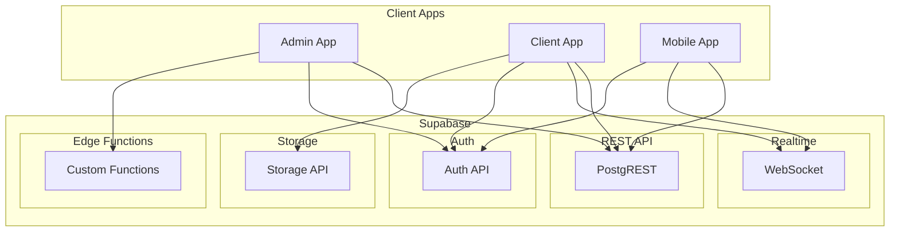

---

## Authentication APIs

### Sign Up
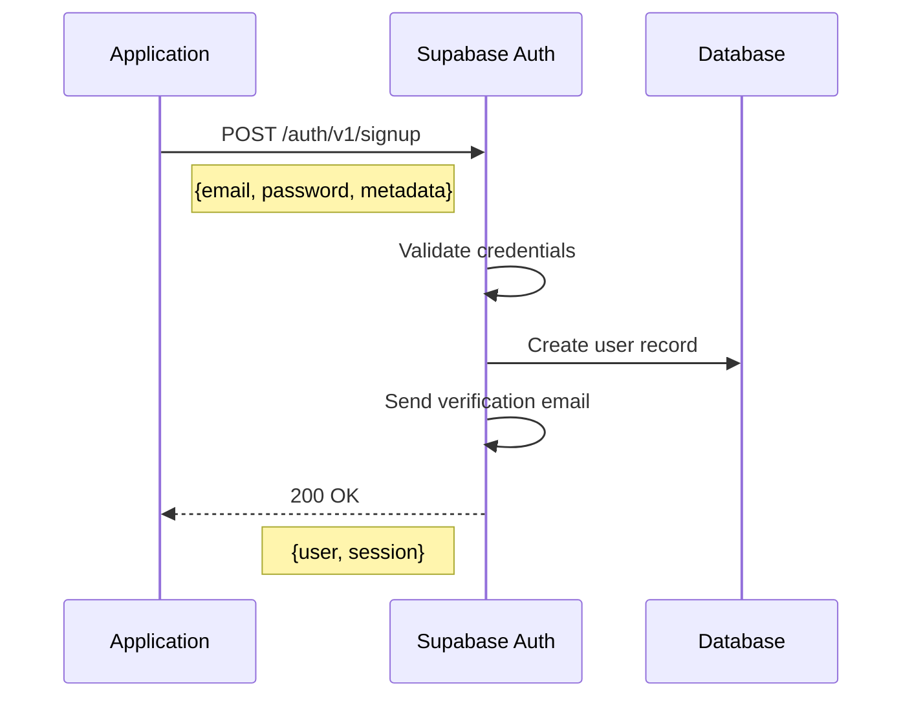

**Request:**
```json
{
  "email": "user@example.com",
  "password": "securePassword123",
  "data": {
    "name": "محمد أحمد",
    "phone": "01234567890"
  }
}
```

### Sign In
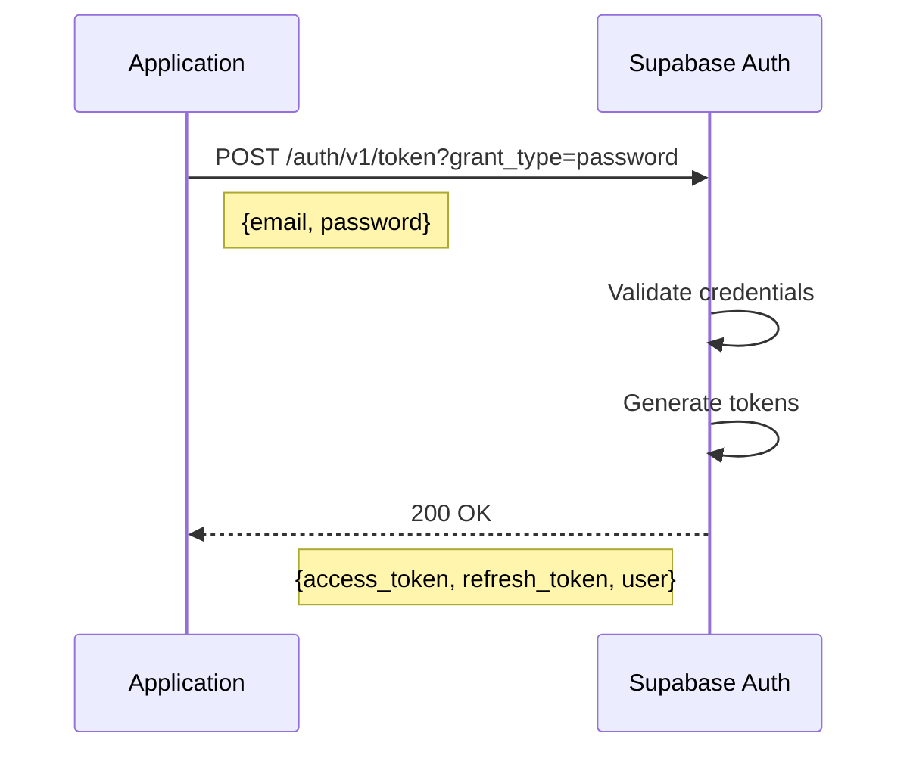

### Refresh Token
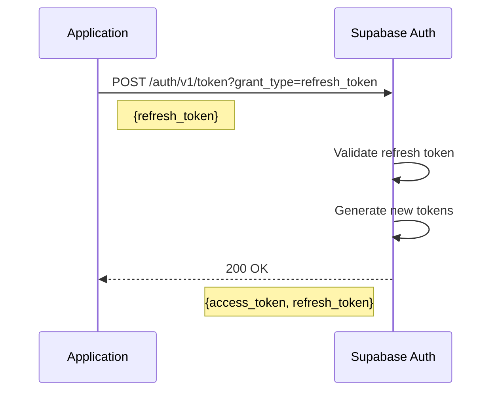

---

## Admin APIs

### Clients

#### List Clients
```
GET /rest/v1/clients
?select=*,subscriptions(*),branches(count)
&order=created_at.desc
&limit=20
&offset=0
```

#### Get Client Details
```
GET /rest/v1/clients
?id=eq.{client_id}
&select=*,
  subscriptions(*,plans(*)),
  branches(*),
  devices(*),
  client_users(*)
```

#### Create Client
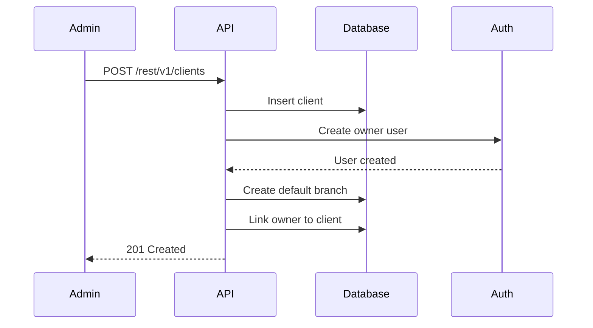

**Request:**
```json
{
  "name_ar": "محلات أحمد",
  "email": "ahmed@example.com",
  "phone": "01234567890",
  "branches_mode": "shared",
  "sync_mode": "auto"
}
```

#### Update Client Status
```
PATCH /rest/v1/clients?id=eq.{client_id}
```
```json
{
  "status": "suspended"
}
```

---

### Plans

#### List Plans
```
GET /rest/v1/plans
?select=*,plan_features(features(*))
&is_active=eq.true
&order=display_order
```

#### Create Plan
```
POST /rest/v1/plans
```
```json
{
  "name_ar": "الباقة الأساسية",
  "name_en": "Basic Plan",
  "price_monthly": 199,
  "price_yearly": 1999,
  "max_devices": 1,
  "max_branches": 1,
  "max_users": 5,
  "trial_days": 14
}
```

#### Update Plan Features
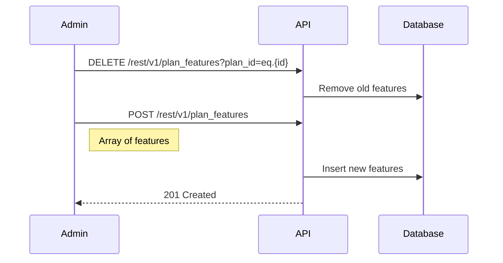

---

### Subscriptions

#### Create Subscription
```
POST /rest/v1/subscriptions
```
```json
{
  "client_id": "uuid",
  "plan_id": "uuid",
  "status": "trial",
  "trial_start_date": "2025-12-01",
  "trial_end_date": "2025-12-15",
  "billing_cycle": "monthly"
}
```

#### Activate Subscription
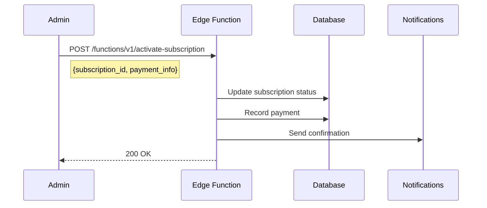

---

### Devices

#### List Pending Devices
```
GET /rest/v1/devices
?status=eq.pending
&select=*,clients(name_ar),branches(name_ar)
&order=created_at.desc
```

#### Approve Device
```
PATCH /rest/v1/devices?id=eq.{device_id}
```
```json
{
  "status": "approved",
  "change_approved_by": "admin_user_id",
  "change_approved_at": "2025-12-01T10:00:00Z"
}
```

---

## Client APIs

### Products

#### List Products (with sync)
```
GET /rest/v1/products
?client_id=eq.{client_id}
&or=(branch_id.is.null,branch_id.eq.{branch_id})
&is_deleted=eq.false
&server_updated_at=gt.{last_sync_timestamp}
&select=*,categories(name_ar),inventory!inner(quantity)
```

#### Upsert Product (sync)
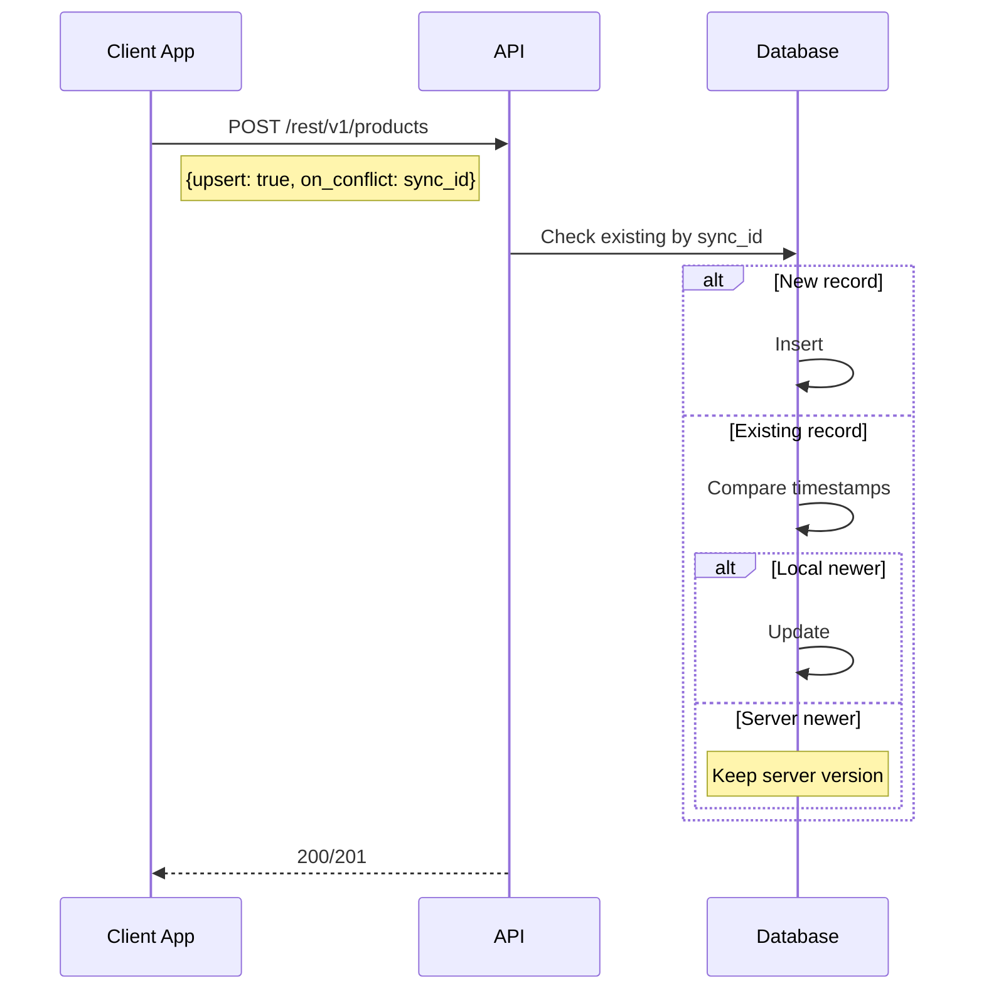

**Request:**
```json
{
  "sync_id": "uuid",
  "client_id": "uuid",
  "branch_id": "uuid",
  "name_ar": "منتج جديد",
  "barcode": "123456789",
  "sell_price": 100,
  "sync_status": "synced",
  "local_updated_at": "2025-12-01T10:00:00Z"
}
```

---

### Invoices

#### Create Invoice (with items)
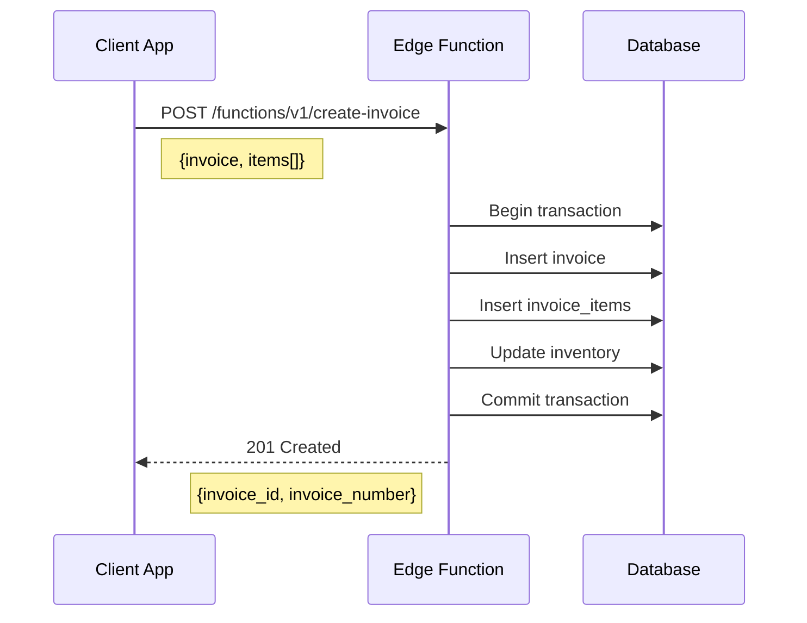

**Request:**
```json
{
  "invoice": {
    "sync_id": "uuid",
    "client_id": "uuid",
    "branch_id": "uuid",
    "customer_id": "uuid",
    "subtotal": 500,
    "discount_amount": 50,
    "tax_amount": 45,
    "total": 495,
    "paid_amount": 500,
    "payment_method": "cash"
  },
  "items": [
    {
      "product_id": "uuid",
      "product_name": "منتج 1",
      "quantity": 2,
      "unit_price": 100,
      "total": 200
    }
  ]
}
```

#### Get Invoices (paginated)
```
GET /rest/v1/invoices
?client_id=eq.{client_id}
&branch_id=eq.{branch_id}
&invoice_date=gte.{start_date}
&invoice_date=lte.{end_date}
&select=*,customers(name),invoice_items(*)
&order=invoice_date.desc
&limit=50
&offset=0
```

---

### Sync APIs

#### Push Changes (Batch)
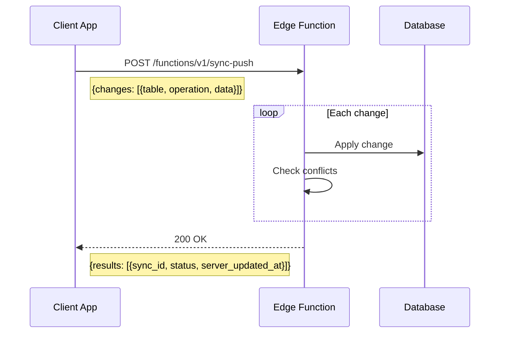

**Request:**
```json
{
  "device_id": "uuid",
  "changes": [
    {
      "table": "products",
      "operation": "update",
      "sync_id": "uuid",
      "data": {
        "name_ar": "اسم جديد",
        "local_updated_at": "2025-12-01T10:00:00Z"
      }
    },
    {
      "table": "invoices",
      "operation": "create",
      "sync_id": "uuid",
      "data": { ... }
    }
  ]
}
```

**Response:**
```json
{
  "results": [
    {
      "sync_id": "uuid",
      "status": "success",
      "server_updated_at": "2025-12-01T10:00:01Z"
    },
    {
      "sync_id": "uuid",
      "status": "conflict",
      "server_data": { ... }
    }
  ]
}
```

#### Pull Changes
```
GET /rest/v1/rpc/sync_pull
```
```json
{
  "client_id": "uuid",
  "branch_id": "uuid",
  "last_sync_at": "2025-12-01T09:00:00Z",
  "tables": ["products", "categories", "customers"]
}
```

**Response:**
```json
{
  "products": [
    { "sync_id": "...", "name_ar": "...", ... }
  ],
  "categories": [...],
  "customers": [...],
  "sync_timestamp": "2025-12-01T10:00:00Z"
}
```

---

## Realtime Subscriptions

### Subscribe to Changes
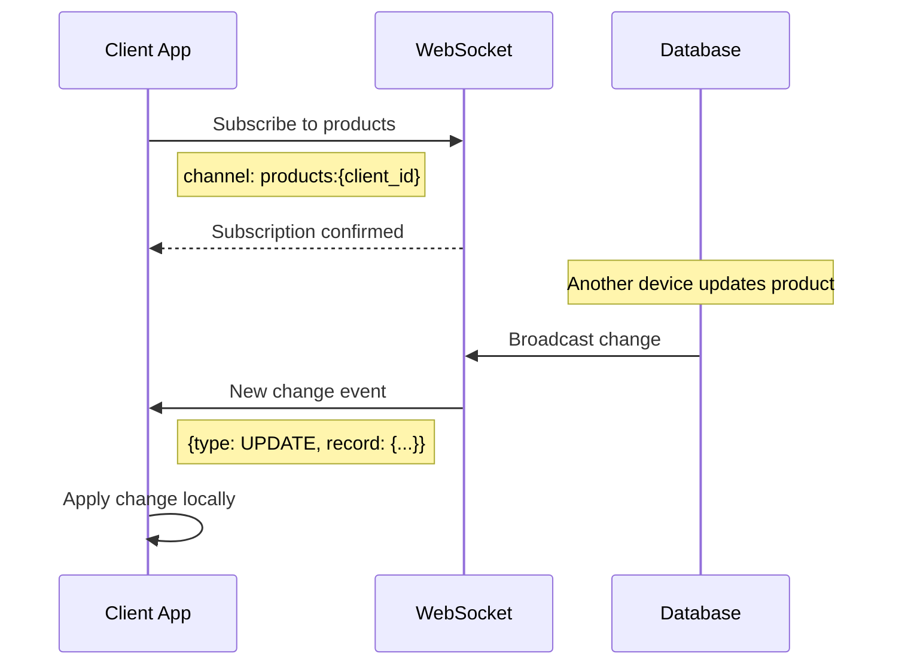

**JavaScript Example:**
```javascript
const channel = supabase
  .channel('products-changes')
  .on(
    'postgres_changes',
    {
      event: '*',
      schema: 'public',
      table: 'products',
      filter: `client_id=eq.${clientId}`
    },
    (payload) => {
      handleProductChange(payload)
    }
  )
  .subscribe()
```

---

## Edge Functions

### Check Subscription
```
POST /functions/v1/check-subscription
```
```json
{
  "client_id": "uuid",
  "device_fingerprint": "..."
}
```

**Response:**
```json
{
  "valid": true,
  "subscription": {
    "plan_name": "Pro",
    "status": "active",
    "end_date": "2026-01-01",
    "features": ["pos", "inventory", "whatsapp"],
    "limits": {
      "max_devices": 3,
      "current_devices": 2
    }
  }
}
```

### Send Notification
```
POST /functions/v1/send-notification
```
```json
{
  "client_id": "uuid",
  "channels": ["email", "whatsapp"],
  "template": "subscription_expiring",
  "data": {
    "days_remaining": 7
  }
}
```

---

## Error Responses

### Standard Error Format
```json
{
  "error": {
    "code": "SUBSCRIPTION_EXPIRED",
    "message": "Your subscription has expired",
    "details": {
      "expired_at": "2025-11-30T23:59:59Z"
    }
  }
}
```

### Error Codes
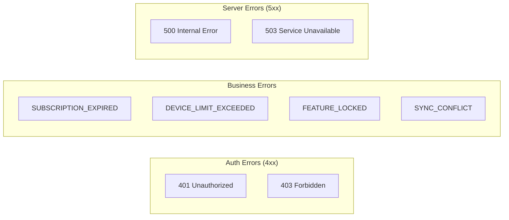

| Code | HTTP Status | Description |
|------|-------------|-------------|
| `UNAUTHORIZED` | 401 | Invalid or missing token |
| `FORBIDDEN` | 403 | No permission |
| `NOT_FOUND` | 404 | Resource not found |
| `SUBSCRIPTION_EXPIRED` | 403 | Subscription ended |
| `DEVICE_LIMIT_EXCEEDED` | 403 | Too many devices |
| `FEATURE_LOCKED` | 403 | Feature not in plan |
| `SYNC_CONFLICT` | 409 | Data conflict |
| `VALIDATION_ERROR` | 422 | Invalid data |
