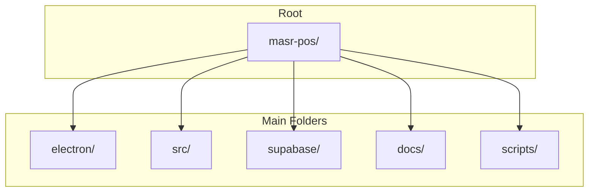
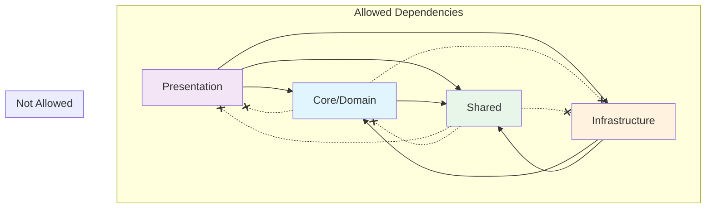
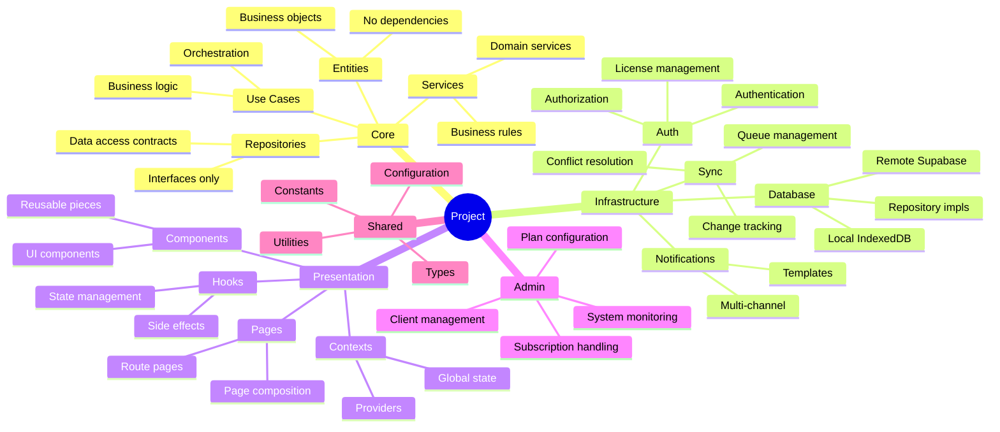

# 📁 Project Structure

## Overview



---

## Complete Structure

```
masr-pos/
│
├── 📁 electron/                    # Electron Main Process
│   ├── main.ts                     # Main entry point
│   ├── preload.ts                  # Preload script
│   │
│   ├── 📁 handlers/                # IPC Handlers
│   │   ├── index.ts                # Export all handlers
│   │   ├── licenseManager.ts       # License & device management
│   │   ├── syncManager.ts          # Sync operations
│   │   ├── updateManager.ts        # Auto-update
│   │   ├── printHandler.ts         # Printing
│   │   └── whatsappHandler.ts      # WhatsApp integration
│   │
│   └── 📁 utils/                   # Electron utilities
│       ├── crypto-polyfill.ts
│       └── storage.ts
│
├── 📁 src/                         # React Application
│   │
│   ├── 📁 core/                    # 🏛️ Domain Layer
│   │   │
│   │   ├── 📁 entities/            # Domain Entities
│   │   │   ├── index.ts
│   │   │   ├── Product.ts
│   │   │   ├── Category.ts
│   │   │   ├── Customer.ts
│   │   │   ├── Invoice.ts
│   │   │   ├── InvoiceItem.ts
│   │   │   ├── Employee.ts
│   │   │   ├── Branch.ts
│   │   │   ├── Shift.ts
│   │   │   └── Expense.ts
│   │   │
│   │   ├── 📁 repositories/        # Repository Interfaces
│   │   │   ├── index.ts
│   │   │   ├── IBaseRepository.ts
│   │   │   ├── IProductRepository.ts
│   │   │   ├── ICategoryRepository.ts
│   │   │   ├── ICustomerRepository.ts
│   │   │   ├── IInvoiceRepository.ts
│   │   │   └── ...
│   │   │
│   │   ├── 📁 use-cases/           # Business Use Cases
│   │   │   ├── index.ts
│   │   │   │
│   │   │   ├── 📁 products/
│   │   │   │   ├── CreateProduct.ts
│   │   │   │   ├── UpdateProduct.ts
│   │   │   │   ├── DeleteProduct.ts
│   │   │   │   ├── GetProducts.ts
│   │   │   │   └── SearchProducts.ts
│   │   │   │
│   │   │   ├── 📁 invoices/
│   │   │   │   ├── CreateInvoice.ts
│   │   │   │   ├── VoidInvoice.ts
│   │   │   │   ├── GetInvoices.ts
│   │   │   │   └── GetDailyReport.ts
│   │   │   │
│   │   │   ├── 📁 inventory/
│   │   │   │   ├── AddStock.ts
│   │   │   │   ├── RemoveStock.ts
│   │   │   │   ├── TransferStock.ts
│   │   │   │   └── StockCount.ts
│   │   │   │
│   │   │   └── 📁 shifts/
│   │   │       ├── OpenShift.ts
│   │   │       ├── CloseShift.ts
│   │   │       └── CashMovement.ts
│   │   │
│   │   └── 📁 services/            # Domain Services
│   │       ├── index.ts
│   │       ├── PricingService.ts
│   │       ├── DiscountService.ts
│   │       ├── TaxService.ts
│   │       └── InventoryService.ts
│   │
│   ├── 📁 infrastructure/          # 🔧 Infrastructure Layer
│   │   │
│   │   ├── 📁 database/
│   │   │   │
│   │   │   ├── 📁 local/           # IndexedDB
│   │   │   │   ├── index.ts
│   │   │   │   ├── LocalDatabase.ts
│   │   │   │   ├── 📁 schemas/
│   │   │   │   │   └── schema.ts
│   │   │   │   └── 📁 migrations/
│   │   │   │       ├── v1.ts
│   │   │   │       └── v2.ts
│   │   │   │
│   │   │   ├── 📁 remote/          # Supabase
│   │   │   │   ├── index.ts
│   │   │   │   ├── SupabaseClient.ts
│   │   │   │   └── 📁 queries/
│   │   │   │       ├── productQueries.ts
│   │   │   │       ├── invoiceQueries.ts
│   │   │   │       └── ...
│   │   │   │
│   │   │   └── 📁 repositories/    # Repository Implementations
│   │   │       ├── index.ts
│   │   │       ├── BaseRepository.ts
│   │   │       ├── ProductRepository.ts
│   │   │       ├── CategoryRepository.ts
│   │   │       ├── CustomerRepository.ts
│   │   │       ├── InvoiceRepository.ts
│   │   │       └── ...
│   │   │
│   │   ├── 📁 sync/                # Sync Engine
│   │   │   ├── index.ts
│   │   │   ├── SyncEngine.ts
│   │   │   ├── SyncQueue.ts
│   │   │   ├── ChangeTracker.ts
│   │   │   ├── ConflictResolver.ts
│   │   │   ├── OnlineStatusMonitor.ts
│   │   │   └── 📁 strategies/
│   │   │       ├── LastWriteWins.ts
│   │   │       ├── ServerWins.ts
│   │   │       └── ClientWins.ts
│   │   │
│   │   ├── 📁 auth/                # Authentication
│   │   │   ├── index.ts
│   │   │   ├── AuthService.ts
│   │   │   ├── LicenseService.ts
│   │   │   ├── SubscriptionService.ts
│   │   │   └── DeviceService.ts
│   │   │
│   │   ├── 📁 notifications/       # Notifications
│   │   │   ├── index.ts
│   │   │   ├── NotificationService.ts
│   │   │   ├── 📁 providers/
│   │   │   │   ├── InAppProvider.ts
│   │   │   │   ├── EmailProvider.ts
│   │   │   │   ├── SMSProvider.ts
│   │   │   │   ├── WhatsAppProvider.ts
│   │   │   │   └── PushProvider.ts
│   │   │   └── 📁 templates/
│   │   │       └── ...
│   │   │
│   │   ├── 📁 printing/            # Printing
│   │   │   ├── index.ts
│   │   │   ├── PrintService.ts
│   │   │   ├── ThermalPrinter.ts
│   │   │   ├── A4Printer.ts
│   │   │   └── 📁 templates/
│   │   │       ├── InvoiceReceipt.ts
│   │   │       ├── XReport.ts
│   │   │       └── ZReport.ts
│   │   │
│   │   └── 📁 updates/             # App Updates
│   │       ├── index.ts
│   │       └── UpdateService.ts
│   │
│   ├── 📁 presentation/            # 🎨 Presentation Layer
│   │   │
│   │   ├── 📁 components/
│   │   │   │
│   │   │   ├── 📁 ui/              # Base UI (shadcn)
│   │   │   │   ├── button.tsx
│   │   │   │   ├── input.tsx
│   │   │   │   ├── card.tsx
│   │   │   │   └── ...
│   │   │   │
│   │   │   ├── 📁 common/          # Shared Components
│   │   │   │   ├── index.ts
│   │   │   │   ├── DataTable.tsx
│   │   │   │   ├── SearchInput.tsx
│   │   │   │   ├── ConfirmDialog.tsx
│   │   │   │   ├── LoadingSpinner.tsx
│   │   │   │   ├── EmptyState.tsx
│   │   │   │   ├── SyncStatus.tsx
│   │   │   │   └── FeatureGate.tsx
│   │   │   │
│   │   │   ├── 📁 layout/          # Layout Components
│   │   │   │   ├── index.ts
│   │   │   │   ├── AppLayout.tsx
│   │   │   │   ├── Header.tsx
│   │   │   │   ├── Sidebar.tsx
│   │   │   │   └── Footer.tsx
│   │   │   │
│   │   │   ├── 📁 pos/             # POS Components
│   │   │   │   ├── index.ts
│   │   │   │   ├── POSHeader.tsx
│   │   │   │   ├── ProductGrid.tsx
│   │   │   │   ├── ProductCard.tsx
│   │   │   │   ├── Cart.tsx
│   │   │   │   ├── CartItem.tsx
│   │   │   │   ├── PaymentDialog.tsx
│   │   │   │   ├── CustomerSelect.tsx
│   │   │   │   └── InvoicePrint.tsx
│   │   │   │
│   │   │   ├── 📁 inventory/       # Inventory Components
│   │   │   │   ├── index.ts
│   │   │   │   ├── ProductForm.tsx
│   │   │   │   ├── ProductList.tsx
│   │   │   │   ├── CategoryTree.tsx
│   │   │   │   ├── StockMovementForm.tsx
│   │   │   │   └── LowStockAlert.tsx
│   │   │   │
│   │   │   ├── 📁 reports/         # Report Components
│   │   │   │   ├── index.ts
│   │   │   │   ├── SalesChart.tsx
│   │   │   │   ├── ReportFilters.tsx
│   │   │   │   ├── ReportTable.tsx
│   │   │   │   └── ExportButtons.tsx
│   │   │   │
│   │   │   └── 📁 dialogs/         # Dialog Components
│   │   │       ├── index.ts
│   │   │       ├── ShiftDialog.tsx
│   │   │       ├── CashMovementDialog.tsx
│   │   │       └── XZReportDialog.tsx
│   │   │
│   │   ├── 📁 pages/               # Pages
│   │   │   │
│   │   │   ├── 📁 auth/
│   │   │   │   ├── Login.tsx
│   │   │   │   ├── ForgotPassword.tsx
│   │   │   │   └── PinLogin.tsx
│   │   │   │
│   │   │   ├── 📁 pos/
│   │   │   │   ├── POS.tsx
│   │   │   │   └── Restaurant.tsx
│   │   │   │
│   │   │   ├── 📁 inventory/
│   │   │   │   ├── Products.tsx
│   │   │   │   ├── Categories.tsx
│   │   │   │   ├── StockMovements.tsx
│   │   │   │   └── StockCount.tsx
│   │   │   │
│   │   │   ├── 📁 sales/
│   │   │   │   ├── Invoices.tsx
│   │   │   │   ├── Returns.tsx
│   │   │   │   └── Customers.tsx
│   │   │   │
│   │   │   ├── 📁 purchases/
│   │   │   │   ├── Purchases.tsx
│   │   │   │   ├── PurchaseReturns.tsx
│   │   │   │   └── Suppliers.tsx
│   │   │   │
│   │   │   ├── 📁 finance/
│   │   │   │   ├── Shifts.tsx
│   │   │   │   ├── Expenses.tsx
│   │   │   │   ├── Deposits.tsx
│   │   │   │   └── Installments.tsx
│   │   │   │
│   │   │   ├── 📁 employees/
│   │   │   │   ├── Employees.tsx
│   │   │   │   ├── Roles.tsx
│   │   │   │   └── Attendance.tsx
│   │   │   │
│   │   │   ├── 📁 reports/
│   │   │   │   ├── Dashboard.tsx
│   │   │   │   ├── SalesReport.tsx
│   │   │   │   ├── InventoryReport.tsx
│   │   │   │   └── FinanceReport.tsx
│   │   │   │
│   │   │   ├── 📁 settings/
│   │   │   │   ├── Settings.tsx
│   │   │   │   ├── PrinterSettings.tsx
│   │   │   │   ├── SyncSettings.tsx
│   │   │   │   └── BranchSettings.tsx
│   │   │   │
│   │   │   └── 📁 branches/
│   │   │       ├── Branches.tsx
│   │   │       └── BranchSelect.tsx
│   │   │
│   │   ├── 📁 hooks/               # React Hooks
│   │   │   ├── index.ts
│   │   │   ├── useProducts.ts
│   │   │   ├── useCategories.ts
│   │   │   ├── useCustomers.ts
│   │   │   ├── useInvoices.ts
│   │   │   ├── useShift.ts
│   │   │   ├── useSync.ts
│   │   │   ├── useOnlineStatus.ts
│   │   │   ├── useFeatureAccess.ts
│   │   │   └── useBranch.ts
│   │   │
│   │   └── 📁 contexts/            # React Contexts
│   │       ├── index.ts
│   │       ├── AuthContext.tsx
│   │       ├── BranchContext.tsx
│   │       ├── ShiftContext.tsx
│   │       ├── SyncContext.tsx
│   │       ├── SettingsContext.tsx
│   │       └── SubscriptionContext.tsx
│   │
│   ├── 📁 admin/                   # 👑 Admin Module
│   │   │
│   │   ├── 📁 pages/
│   │   │   ├── Dashboard.tsx
│   │   │   ├── Clients.tsx
│   │   │   ├── ClientDetail.tsx
│   │   │   ├── Plans.tsx
│   │   │   ├── PlanBuilder.tsx
│   │   │   ├── Features.tsx
│   │   │   ├── Subscriptions.tsx
│   │   │   ├── Devices.tsx
│   │   │   ├── Payments.tsx
│   │   │   ├── Reports.tsx
│   │   │   ├── Communications.tsx
│   │   │   └── Settings.tsx
│   │   │
│   │   ├── 📁 components/
│   │   │   ├── ClientsTable.tsx
│   │   │   ├── ClientCard.tsx
│   │   │   ├── SubscriptionCard.tsx
│   │   │   ├── DeviceApproval.tsx
│   │   │   ├── PlanFeatureMatrix.tsx
│   │   │   ├── RevenueChart.tsx
│   │   │   └── NotificationComposer.tsx
│   │   │
│   │   └── 📁 hooks/
│   │       ├── useClients.ts
│   │       ├── usePlans.ts
│   │       ├── useSubscriptions.ts
│   │       └── useAdminReports.ts
│   │
│   ├── 📁 shared/                  # 🔗 Shared Code
│   │   │
│   │   ├── 📁 types/               # TypeScript Types
│   │   │   ├── index.ts
│   │   │   ├── entities.ts
│   │   │   ├── api.ts
│   │   │   ├── sync.ts
│   │   │   └── admin.ts
│   │   │
│   │   ├── 📁 constants/           # Constants
│   │   │   ├── index.ts
│   │   │   ├── features.ts
│   │   │   ├── permissions.ts
│   │   │   └── syncConfig.ts
│   │   │
│   │   ├── 📁 utils/               # Utilities
│   │   │   ├── index.ts
│   │   │   ├── formatters.ts
│   │   │   ├── validators.ts
│   │   │   ├── dateUtils.ts
│   │   │   └── numberUtils.ts
│   │   │
│   │   └── 📁 config/              # Configuration
│   │       ├── index.ts
│   │       ├── app.config.ts
│   │       ├── supabase.config.ts
│   │       └── features.config.ts
│   │
│   ├── App.tsx                     # Main App (Client)
│   ├── AdminApp.tsx                # Admin App
│   ├── main.tsx                    # Entry Point
│   └── routes.tsx                  # Route Definitions
│
├── 📁 supabase/                    # Supabase Configuration
│   │
│   ├── 📁 migrations/              # Database Migrations
│   │   ├── 00001_initial_schema.sql
│   │   ├── 00002_rls_policies.sql
│   │   ├── 00003_functions.sql
│   │   └── 00004_triggers.sql
│   │
│   ├── 📁 functions/               # Edge Functions
│   │   │
│   │   ├── 📁 check-subscription/
│   │   │   └── index.ts
│   │   │
│   │   ├── 📁 sync-push/
│   │   │   └── index.ts
│   │   │
│   │   ├── 📁 sync-pull/
│   │   │   └── index.ts
│   │   │
│   │   ├── 📁 create-invoice/
│   │   │   └── index.ts
│   │   │
│   │   ├── 📁 activate-subscription/
│   │   │   └── index.ts
│   │   │
│   │   └── 📁 send-notification/
│   │       └── index.ts
│   │
│   ├── 📁 seed/                    # Seed Data
│   │   ├── features.sql
│   │   └── default_plans.sql
│   │
│   └── config.toml                 # Supabase Config
│
├── 📁 scripts/                     # Build & Utility Scripts
│   ├── generate-types.ts           # Generate TS types from DB
│   ├── migrate.ts                  # Run migrations
│   └── seed.ts                     # Seed database
│
├── 📁 docs/                        # Documentation
│   ├── 00-overview.md
│   ├── 01-architecture.md
│   ├── 02-database-schema.md
│   ├── 03-sync-strategy.md
│   ├── 04-security.md
│   ├── 05-admin-system.md
│   ├── 06-client-system.md
│   ├── 07-api-reference.md
│   ├── 08-project-structure.md
│   └── 09-deployment.md
│
├── 📁 tests/                       # Tests
│   ├── 📁 unit/
│   ├── 📁 integration/
│   └── 📁 e2e/
│
├── .env.example                    # Environment Variables
├── package.json
├── tsconfig.json
├── vite.config.ts
├── tailwind.config.ts
└── README.md
```

---

## Layer Dependencies



---

## Module Responsibilities


